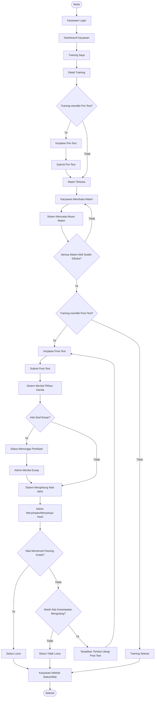

# 03. User Flow / Use Case

# Sistem E-Learning Training Karyawan

------

## 3.1 Ringkasan Dokumen

Dokumen **User Flow / Use Case** ini menjelaskan alur penggunaan sistem E-Learning Training Karyawan berdasarkan aktor yang terlibat, proses utama, langkah per proses, alur alternatif, serta kondisi pengecualian yang mungkin terjadi.

Dokumen ini digunakan sebagai acuan untuk memahami bagaimana Admin dan Karyawan berinteraksi dengan sistem dari awal sampai akhir proses training.

Fokus utama dokumen ini adalah:

1. Menjelaskan siapa aktor yang menggunakan sistem.
2. Menjelaskan apa saja aktivitas yang dilakukan oleh setiap aktor.
3. Menjelaskan alur utama sistem dari setup training sampai laporan.
4. Menjelaskan langkah-langkah setiap proses utama.
5. Menjelaskan alternative flow untuk kondisi training yang berbeda.
6. Menjelaskan exception flow untuk kondisi error atau akses tidak valid.
7. Menjadi acuan untuk desain UI, pengembangan fitur, dan pengujian sistem.

------

## 3.2 Aktor Sistem

Sistem memiliki dua aktor utama, yaitu **Admin** dan **Karyawan**.

------

### 3.2.1 Admin

Admin adalah pengguna yang memiliki akses untuk mengelola seluruh proses training.

Admin dapat melakukan aktivitas berikut:

1. Login ke dashboard admin.
2. Mengelola data karyawan.
3. Mengelola data divisi.
4. Mengelola data jabatan.
5. Membuat dan mengelola training.
6. Menambahkan materi training.
7. Membuat soal pre-test dan post-test.
8. Membuat soal pilihan ganda.
9. Membuat soal essay.
10. Mengatur bobot nilai soal.
11. Mengatur passing grade.
12. Mengatur pengulangan post-test.
13. Menugaskan training ke karyawan, divisi, atau jabatan.
14. Melihat progress training karyawan.
15. Menilai jawaban essay.
16. Melihat hasil test.
17. Melihat laporan.
18. Mengekspor laporan ke PDF dan Excel.
19. Mengubah profil dan password admin.

------

### 3.2.2 Karyawan

Karyawan adalah pengguna yang mengikuti training yang diberikan oleh Admin.

Karyawan dapat melakukan aktivitas berikut:

1. Login menggunakan username dan password.
2. Melihat dashboard karyawan.
3. Melihat daftar training yang diberikan.
4. Membuka detail training.
5. Mengerjakan pre-test jika tersedia.
6. Mengakses materi training.
7. Mendownload materi training.
8. Mengerjakan post-test jika tersedia.
9. Mengulang post-test jika diizinkan.
10. Melihat status training.
11. Melihat nilai jika diizinkan oleh Admin.
12. Melihat riwayat training.
13. Mengubah password akun.

------

## 3.3 Gambaran Alur Besar Sistem

Alur besar sistem menggambarkan proses end-to-end dari Admin menyiapkan training sampai Karyawan menyelesaikan training dan Admin melihat laporan.

### 3.3.1 End-to-End Flow Utama

1. Admin login ke sistem.
2. Admin mengelola master data, seperti karyawan, divisi, dan jabatan.
3. Admin membuat data training.
4. Admin menambahkan materi training.
5. Admin membuat soal pre-test dan/atau post-test.
6. Admin mengatur bobot nilai soal.
7. Admin mengatur passing grade.
8. Admin mengatur pengulangan post-test.
9. Admin mem-publish training.
10. Admin menugaskan training ke karyawan, divisi, atau jabatan.
11. Karyawan login ke sistem.
12. Karyawan melihat daftar training yang diberikan.
13. Karyawan membuka detail training.
14. Jika training memiliki pre-test, karyawan mengerjakan pre-test terlebih dahulu.
15. Setelah pre-test disubmit, materi training terbuka.
16. Karyawan membuka semua materi aktif.
17. Sistem mencatat materi yang sudah dibuka oleh karyawan.
18. Setelah semua materi aktif pernah dibuka, post-test terbuka.
19. Karyawan mengerjakan post-test.
20. Sistem menyimpan jawaban post-test.
21. Sistem menilai soal pilihan ganda secara otomatis.
22. Jika test memiliki soal essay, status menjadi **Menunggu Penilaian**.
23. Admin menilai jawaban essay.
24. Sistem menghitung nilai akhir.
25. Admin menyetujui atau menyimpan hasil penilaian.
26. Sistem menentukan status kelulusan.
27. Karyawan melihat status training.
28. Jika pengaturan tampilkan nilai aktif, karyawan dapat melihat nilai.
29. Admin melihat monitoring progress.
30. Admin melihat laporan.
31. Admin mengekspor laporan ke PDF atau Excel jika diperlukan.

------

## 3.4 Use Case Diagram

Diagram berikut menggambarkan hubungan antara aktor dan use case utama pada sistem.

```mermaid
usecaseDiagram
actor Admin
actor Karyawan

Admin --> (Login Admin)
Admin --> (Kelola Karyawan)
Admin --> (Kelola Divisi)
Admin --> (Kelola Jabatan)
Admin --> (Kelola Training)
Admin --> (Kelola Materi Training)
Admin --> (Kelola Soal Test)
Admin --> (Publish Training)
Admin --> (Penugasan Training)
Admin --> (Monitoring Progress)
Admin --> (Menilai Jawaban Essay)
Admin --> (Melihat Hasil Test)
Admin --> (Melihat Laporan)
Admin --> (Export Laporan)
Admin --> (Ubah Password Admin)

Karyawan --> (Login Karyawan)
Karyawan --> (Melihat Dashboard)
Karyawan --> (Melihat Training Saya)
Karyawan --> (Membuka Detail Training)
Karyawan --> (Mengerjakan Pre-Test)
Karyawan --> (Mengakses Materi)
Karyawan --> (Download Materi)
Karyawan --> (Mengerjakan Post-Test)
Karyawan --> (Mengulang Post-Test)
Karyawan --> (Melihat Status dan Nilai)
Karyawan --> (Melihat Riwayat Training)
Karyawan --> (Ubah Password Karyawan)
```

------

## 3.5 Flowchart Proses Training Karyawan

Flowchart berikut menggambarkan alur utama karyawan dalam mengikuti training.



------

# 3.6 Use Case Admin

------

## UC-ADM-001 — Login Admin

| Komponen      | Isi                                        |
| ------------- | ------------------------------------------ |
| Use Case ID   | UC-ADM-001                                 |
| Nama Use Case | Login Admin                                |
| Aktor         | Admin                                      |
| Tujuan        | Admin masuk ke dashboard admin             |
| Precondition  | Admin memiliki username dan password aktif |
| Postcondition | Admin berhasil masuk ke dashboard admin    |

### Main Flow

1. Admin membuka halaman login.
2. Admin mengisi username.
3. Admin mengisi password.
4. Admin klik tombol Login.
5. Sistem memvalidasi username dan password.
6. Sistem memeriksa role pengguna.
7. Jika data valid dan role adalah Admin, sistem mengarahkan Admin ke dashboard admin.

### Alternative Flow

Tidak ada.

### Exception Flow

| Kondisi                 | Respon Sistem                                       |
| ----------------------- | --------------------------------------------------- |
| Username kosong         | Sistem menampilkan pesan bahwa username wajib diisi |
| Password kosong         | Sistem menampilkan pesan bahwa password wajib diisi |
| Username/password salah | Sistem menampilkan pesan login gagal                |
| Role bukan Admin        | Sistem menolak akses ke dashboard admin             |
| Akun tidak aktif        | Sistem menampilkan pesan akun tidak aktif           |

------

## UC-ADM-002 — Mengelola Karyawan

| Komponen      | Isi                                                          |
| ------------- | ------------------------------------------------------------ |
| Use Case ID   | UC-ADM-002                                                   |
| Nama Use Case | Mengelola Karyawan                                           |
| Aktor         | Admin                                                        |
| Tujuan        | Admin mengelola akun dan data karyawan                       |
| Precondition  | Admin sudah login                                            |
| Postcondition | Data karyawan tersimpan, berubah, aktif/nonaktif, atau terhapus sesuai aksi Admin |

### Main Flow Tambah Karyawan

1. Admin membuka menu **Master Data > Karyawan**.
2. Sistem menampilkan daftar karyawan.
3. Admin klik tombol **Tambah Karyawan**.
4. Sistem menampilkan form tambah karyawan.
5. Admin mengisi nama karyawan.
6. Admin mengisi username.
7. Admin mengisi password.
8. Admin mengisi NIP/ID karyawan jika diperlukan.
9. Admin memilih divisi.
10. Admin memilih jabatan.
11. Admin memilih status akun.
12. Admin klik **Simpan**.
13. Sistem memvalidasi data.
14. Sistem mengenkripsi password.
15. Sistem menyimpan data karyawan.
16. Sistem menampilkan notifikasi berhasil.
17. Sistem mengarahkan Admin kembali ke daftar karyawan.

### Alternative Flow

#### Edit Karyawan

1. Admin memilih data karyawan.
2. Admin klik **Edit**.
3. Sistem menampilkan form edit.
4. Admin mengubah data.
5. Admin klik **Simpan**.
6. Sistem menyimpan perubahan.

#### Nonaktifkan Karyawan

1. Admin memilih karyawan.
2. Admin klik **Nonaktifkan**.
3. Sistem menampilkan konfirmasi.
4. Admin menyetujui konfirmasi.
5. Sistem mengubah status akun menjadi nonaktif.

#### Aktifkan Karyawan

1. Admin memilih karyawan nonaktif.
2. Admin klik **Aktifkan**.
3. Sistem mengubah status akun menjadi aktif.

#### Reset Password

1. Admin memilih karyawan.
2. Admin klik **Reset Password**.
3. Sistem menampilkan form password baru.
4. Admin mengisi password baru.
5. Sistem menyimpan password baru dalam bentuk terenkripsi.

#### Delete Permanen

1. Admin memilih karyawan.
2. Admin klik **Delete Permanen**.
3. Sistem menampilkan konfirmasi.
4. Admin menyetujui konfirmasi.
5. Sistem menghapus data karyawan secara permanen.

### Exception Flow

| Kondisi                         | Respon Sistem                                        |
| ------------------------------- | ---------------------------------------------------- |
| Nama kosong                     | Sistem menampilkan pesan nama wajib diisi            |
| Username kosong                 | Sistem menampilkan pesan username wajib diisi        |
| Username sudah digunakan        | Sistem menampilkan pesan username sudah digunakan    |
| Password kurang dari 8 karakter | Sistem menampilkan pesan password minimal 8 karakter |
| Divisi belum dipilih            | Sistem menampilkan pesan divisi wajib dipilih        |
| Jabatan belum dipilih           | Sistem menampilkan pesan jabatan wajib dipilih       |
| Delete permanen dibatalkan      | Sistem tidak menghapus data                          |
| Karyawan nonaktif login         | Sistem menolak login karyawan                        |

------

## UC-ADM-003 — Mengelola Divisi

| Komponen      | Isi                                                          |
| ------------- | ------------------------------------------------------------ |
| Use Case ID   | UC-ADM-003                                                   |
| Nama Use Case | Mengelola Divisi                                             |
| Aktor         | Admin                                                        |
| Tujuan        | Admin mengelola data divisi perusahaan                       |
| Precondition  | Admin sudah login                                            |
| Postcondition | Data divisi tersimpan, berubah, aktif/nonaktif, atau terhapus |

### Main Flow Tambah Divisi

1. Admin membuka menu **Master Data > Divisi**.
2. Sistem menampilkan daftar divisi.
3. Admin klik **Tambah Divisi**.
4. Sistem menampilkan form divisi.
5. Admin mengisi nama divisi.
6. Admin mengisi deskripsi jika diperlukan.
7. Admin memilih status aktif/nonaktif.
8. Admin klik **Simpan**.
9. Sistem memvalidasi data.
10. Sistem menyimpan data divisi.
11. Sistem menampilkan notifikasi berhasil.

### Alternative Flow

#### Edit Divisi

1. Admin memilih divisi.
2. Admin klik **Edit**.
3. Admin mengubah data divisi.
4. Sistem menyimpan perubahan.

#### Nonaktifkan Divisi

1. Admin memilih divisi.
2. Admin klik **Nonaktifkan**.
3. Sistem menampilkan konfirmasi.
4. Admin menyetujui konfirmasi.
5. Sistem mengubah status divisi menjadi nonaktif.

#### Delete Permanen Divisi

1. Admin memilih divisi.
2. Admin klik **Delete Permanen**.
3. Sistem menampilkan konfirmasi.
4. Admin menyetujui konfirmasi.
5. Sistem menghapus data divisi secara permanen.

### Exception Flow

| Kondisi                                      | Respon Sistem                                                |
| -------------------------------------------- | ------------------------------------------------------------ |
| Nama divisi kosong                           | Sistem menampilkan pesan nama divisi wajib diisi             |
| Nama divisi sudah digunakan                  | Sistem menampilkan pesan nama divisi sudah digunakan         |
| Status belum dipilih                         | Sistem menampilkan pesan status wajib dipilih                |
| Delete permanen dibatalkan                   | Sistem tidak menghapus data                                  |
| Divisi nonaktif dipilih saat tambah karyawan | Sistem tidak menampilkan divisi nonaktif sebagai pilihan aktif |

------

## UC-ADM-004 — Mengelola Jabatan

| Komponen      | Isi                                                          |
| ------------- | ------------------------------------------------------------ |
| Use Case ID   | UC-ADM-004                                                   |
| Nama Use Case | Mengelola Jabatan                                            |
| Aktor         | Admin                                                        |
| Tujuan        | Admin mengelola data jabatan karyawan                        |
| Precondition  | Admin sudah login                                            |
| Postcondition | Data jabatan tersimpan, berubah, aktif/nonaktif, atau terhapus |

### Main Flow Tambah Jabatan

1. Admin membuka menu **Master Data > Jabatan**.
2. Sistem menampilkan daftar jabatan.
3. Admin klik **Tambah Jabatan**.
4. Sistem menampilkan form jabatan.
5. Admin mengisi nama jabatan.
6. Admin mengisi deskripsi jika diperlukan.
7. Admin memilih status aktif/nonaktif.
8. Admin klik **Simpan**.
9. Sistem memvalidasi data.
10. Sistem menyimpan data jabatan.
11. Sistem menampilkan notifikasi berhasil.

### Alternative Flow

#### Edit Jabatan

1. Admin memilih jabatan.
2. Admin klik **Edit**.
3. Admin mengubah data jabatan.
4. Sistem menyimpan perubahan.

#### Nonaktifkan Jabatan

1. Admin memilih jabatan.
2. Admin klik **Nonaktifkan**.
3. Sistem menampilkan konfirmasi.
4. Admin menyetujui konfirmasi.
5. Sistem mengubah status jabatan menjadi nonaktif.

#### Delete Permanen Jabatan

1. Admin memilih jabatan.
2. Admin klik **Delete Permanen**.
3. Sistem menampilkan konfirmasi.
4. Admin menyetujui konfirmasi.
5. Sistem menghapus data jabatan secara permanen.

### Exception Flow

| Kondisi                                       | Respon Sistem                                                |
| --------------------------------------------- | ------------------------------------------------------------ |
| Nama jabatan kosong                           | Sistem menampilkan pesan nama jabatan wajib diisi            |
| Nama jabatan sudah digunakan                  | Sistem menampilkan pesan nama jabatan sudah digunakan        |
| Status belum dipilih                          | Sistem menampilkan pesan status wajib dipilih                |
| Delete permanen dibatalkan                    | Sistem tidak menghapus data                                  |
| Jabatan nonaktif dipilih saat tambah karyawan | Sistem tidak menampilkan jabatan nonaktif sebagai pilihan aktif |

------

## UC-TRN-001 — Mengelola Training

| Komponen      | Isi                                                          |
| ------------- | ------------------------------------------------------------ |
| Use Case ID   | UC-TRN-001                                                   |
| Nama Use Case | Mengelola Training                                           |
| Aktor         | Admin                                                        |
| Tujuan        | Admin membuat dan mengatur data training                     |
| Precondition  | Admin sudah login                                            |
| Postcondition | Data training tersimpan sebagai draft, published, atau archived |

### Main Flow Tambah Training

1. Admin membuka menu **Master Training > Daftar Training**.
2. Sistem menampilkan daftar training.
3. Admin klik **Tambah Training**.
4. Sistem menampilkan form tambah training.
5. Admin mengisi judul training.
6. Admin mengisi deskripsi training.
7. Admin mengisi tanggal mulai.
8. Admin mengisi tanggal selesai.
9. Admin memilih apakah training menggunakan pre-test.
10. Admin memilih apakah training menggunakan post-test.
11. Jika post-test aktif, Admin mengisi passing grade.
12. Admin memilih apakah post-test dapat diulang.
13. Jika post-test dapat diulang, Admin mengisi jumlah maksimal pengulangan.
14. Admin memilih apakah nilai ditampilkan ke karyawan.
15. Admin memilih status training.
16. Admin klik **Simpan**.
17. Sistem memvalidasi data.
18. Sistem menyimpan data training.
19. Sistem menampilkan notifikasi berhasil.

### Alternative Flow

#### Edit Training

1. Admin memilih training.
2. Admin klik **Edit**.
3. Sistem menampilkan form edit.
4. Admin mengubah data training.
5. Sistem menyimpan perubahan.

#### Archive Training

1. Admin memilih training.
2. Admin klik **Archive**.
3. Sistem menampilkan konfirmasi.
4. Admin menyetujui konfirmasi.
5. Sistem mengubah status training menjadi archived.
6. Training tidak dapat ditugaskan lagi.

#### Delete Permanen Training

1. Admin memilih training.
2. Admin klik **Delete Permanen**.
3. Sistem menampilkan konfirmasi.
4. Admin menyetujui konfirmasi.
5. Sistem menghapus data training secara permanen.

### Exception Flow

| Kondisi                                     | Respon Sistem                                           |
| ------------------------------------------- | ------------------------------------------------------- |
| Judul training kosong                       | Sistem menampilkan pesan judul wajib diisi              |
| Tanggal mulai kosong                        | Sistem menampilkan pesan tanggal mulai wajib diisi      |
| Tanggal selesai kosong                      | Sistem menampilkan pesan tanggal selesai wajib diisi    |
| Tanggal selesai sebelum tanggal mulai       | Sistem menampilkan pesan tanggal tidak valid            |
| Passing grade kosong saat post-test aktif   | Sistem menampilkan pesan passing grade wajib diisi      |
| Passing grade di luar 0–100                 | Sistem menampilkan pesan passing grade tidak valid      |
| Jumlah pengulangan kosong saat retake aktif | Sistem menampilkan pesan jumlah pengulangan wajib diisi |
| Delete permanen dibatalkan                  | Sistem tidak menghapus training                         |

------

## UC-TRN-002 — Publish Training

| Komponen      | Isi                                              |
| ------------- | ------------------------------------------------ |
| Use Case ID   | UC-TRN-002                                       |
| Nama Use Case | Publish Training                                 |
| Aktor         | Admin                                            |
| Tujuan        | Admin mem-publish training agar dapat ditugaskan |
| Precondition  | Admin sudah login dan training sudah dibuat      |
| Postcondition | Status training berubah menjadi published        |

### Main Flow

1. Admin membuka detail training.
2. Sistem menampilkan detail training.
3. Admin memastikan data training sudah sesuai.
4. Admin klik tombol **Publish**.
5. Sistem menampilkan konfirmasi.
6. Admin menyetujui konfirmasi.
7. Sistem mengubah status training menjadi published.
8. Sistem menampilkan notifikasi berhasil.
9. Training dapat ditugaskan ke karyawan, divisi, atau jabatan.

### Alternative Flow

Tidak ada.

### Exception Flow

| Kondisi                      | Respon Sistem                                        |
| ---------------------------- | ---------------------------------------------------- |
| Admin membatalkan konfirmasi | Sistem tidak mem-publish training                    |
| Training tidak ditemukan     | Sistem menampilkan pesan training tidak ditemukan    |
| Data training tidak valid    | Sistem menampilkan pesan data training belum lengkap |

------

## UC-TRN-003 — Mengelola Materi Training

| Komponen      | Isi                                                          |
| ------------- | ------------------------------------------------------------ |
| Use Case ID   | UC-TRN-003                                                   |
| Nama Use Case | Mengelola Materi Training                                    |
| Aktor         | Admin                                                        |
| Tujuan        | Admin menambahkan dan mengelola materi training              |
| Precondition  | Admin sudah login dan training sudah tersedia                |
| Postcondition | Materi training tersimpan dan dapat diakses karyawan sesuai aturan akses |

### Main Flow Tambah Materi

1. Admin membuka menu **Master Training > Materi Training**.
2. Sistem menampilkan daftar materi.
3. Admin klik **Tambah Materi**.
4. Sistem menampilkan form tambah materi.
5. Admin memilih training.
6. Admin mengisi judul materi.
7. Admin memilih tipe materi, yaitu file atau link.
8. Jika tipe materi adalah file, Admin mengupload file.
9. Jika tipe materi adalah link, Admin mengisi URL materi.
10. Admin memilih status materi.
11. Admin klik **Simpan**.
12. Sistem memvalidasi data.
13. Sistem menyimpan materi.
14. Sistem menampilkan notifikasi berhasil.

### Alternative Flow

#### Edit Materi

1. Admin memilih materi.
2. Admin klik **Edit**.
3. Admin mengubah data materi.
4. Sistem menyimpan perubahan.

#### Nonaktifkan Materi

1. Admin memilih materi.
2. Admin klik **Nonaktifkan**.
3. Sistem mengubah status materi menjadi nonaktif.
4. Materi tidak tampil di halaman karyawan.

#### Delete Permanen Materi

1. Admin memilih materi.
2. Admin klik **Delete Permanen**.
3. Sistem menampilkan konfirmasi.
4. Admin menyetujui konfirmasi.
5. Sistem menghapus materi secara permanen.

### Exception Flow

| Kondisi                    | Respon Sistem                                       |
| -------------------------- | --------------------------------------------------- |
| Training belum dipilih     | Sistem menampilkan pesan training wajib dipilih     |
| Judul materi kosong        | Sistem menampilkan pesan judul materi wajib diisi   |
| Tipe materi belum dipilih  | Sistem menampilkan pesan tipe materi wajib dipilih  |
| File belum diupload        | Sistem menampilkan pesan file wajib diupload        |
| URL kosong                 | Sistem menampilkan pesan URL wajib diisi            |
| URL tidak valid            | Sistem menampilkan pesan URL tidak valid            |
| Format file tidak didukung | Sistem menampilkan pesan format file tidak didukung |
| Ukuran file melebihi batas | Sistem menampilkan pesan ukuran file melebihi batas |
| Delete permanen dibatalkan | Sistem tidak menghapus materi                       |

------

## UC-TRN-004 — Mengelola Soal Pilihan Ganda

| Komponen      | Isi                                                          |
| ------------- | ------------------------------------------------------------ |
| Use Case ID   | UC-TRN-004                                                   |
| Nama Use Case | Mengelola Soal Pilihan Ganda                                 |
| Aktor         | Admin                                                        |
| Tujuan        | Admin membuat soal pilihan ganda untuk pre-test atau post-test |
| Precondition  | Admin sudah login dan training sudah tersedia                |
| Postcondition | Soal pilihan ganda tersimpan                                 |

### Main Flow

1. Admin membuka menu **Master Training > Soal Test**.
2. Sistem menampilkan daftar soal.
3. Admin klik **Tambah Soal**.
4. Sistem menampilkan form soal.
5. Admin memilih training.
6. Admin memilih jenis test, yaitu pre-test atau post-test.
7. Admin mengisi nomor soal.
8. Admin memilih jenis soal **Pilihan Ganda**.
9. Admin mengisi pertanyaan.
10. Admin mengisi pilihan jawaban.
11. Admin menentukan kunci jawaban.
12. Admin mengisi bobot nilai.
13. Admin memilih status soal.
14. Admin klik **Simpan**.
15. Sistem memvalidasi data.
16. Sistem menyimpan soal.
17. Sistem menampilkan notifikasi berhasil.

### Alternative Flow

#### Edit Soal Pilihan Ganda

1. Admin memilih soal.
2. Admin klik **Edit**.
3. Admin mengubah pertanyaan, pilihan jawaban, kunci jawaban, bobot, atau status.
4. Sistem menyimpan perubahan.

#### Nonaktifkan Soal

1. Admin memilih soal.
2. Admin klik **Nonaktifkan**.
3. Sistem mengubah status soal menjadi nonaktif.
4. Soal tidak tampil saat karyawan mengerjakan test.

#### Delete Permanen Soal

1. Admin memilih soal.
2. Admin klik **Delete Permanen**.
3. Sistem menampilkan konfirmasi.
4. Admin menyetujui konfirmasi.
5. Sistem menghapus soal secara permanen.

### Exception Flow

| Kondisi                    | Respon Sistem                                        |
| -------------------------- | ---------------------------------------------------- |
| Training belum dipilih     | Sistem menampilkan pesan training wajib dipilih      |
| Jenis test belum dipilih   | Sistem menampilkan pesan jenis test wajib dipilih    |
| Nomor soal kosong          | Sistem menampilkan pesan nomor soal wajib diisi      |
| Nomor soal sudah digunakan | Sistem menampilkan pesan nomor soal sudah digunakan  |
| Pertanyaan kosong          | Sistem menampilkan pesan pertanyaan wajib diisi      |
| Pilihan jawaban kosong     | Sistem menampilkan pesan pilihan jawaban wajib diisi |
| Kunci jawaban kosong       | Sistem menampilkan pesan kunci jawaban wajib dipilih |
| Bobot kosong               | Sistem menampilkan pesan bobot wajib diisi           |
| Bobot tidak valid          | Sistem menampilkan pesan bobot harus lebih dari 0    |

------

## UC-TRN-005 — Mengelola Soal Essay

| Komponen      | Isi                                                    |
| ------------- | ------------------------------------------------------ |
| Use Case ID   | UC-TRN-005                                             |
| Nama Use Case | Mengelola Soal Essay                                   |
| Aktor         | Admin                                                  |
| Tujuan        | Admin membuat soal essay untuk pre-test atau post-test |
| Precondition  | Admin sudah login dan training sudah tersedia          |
| Postcondition | Soal essay tersimpan                                   |

### Main Flow

1. Admin membuka menu **Master Training > Soal Test**.
2. Sistem menampilkan daftar soal.
3. Admin klik **Tambah Soal**.
4. Sistem menampilkan form soal.
5. Admin memilih training.
6. Admin memilih jenis test, yaitu pre-test atau post-test.
7. Admin mengisi nomor soal.
8. Admin memilih jenis soal **Essay**.
9. Admin mengisi pertanyaan.
10. Admin mengisi bobot nilai.
11. Admin memilih status soal.
12. Admin klik **Simpan**.
13. Sistem memvalidasi data.
14. Sistem menyimpan soal.
15. Sistem menampilkan notifikasi berhasil.

### Alternative Flow

#### Edit Soal Essay

1. Admin memilih soal essay.
2. Admin klik **Edit**.
3. Admin mengubah pertanyaan, bobot, atau status.
4. Sistem menyimpan perubahan.

#### Nonaktifkan Soal Essay

1. Admin memilih soal essay.
2. Admin klik **Nonaktifkan**.
3. Sistem mengubah status soal menjadi nonaktif.

#### Delete Permanen Soal Essay

1. Admin memilih soal essay.
2. Admin klik **Delete Permanen**.
3. Sistem menampilkan konfirmasi.
4. Admin menyetujui konfirmasi.
5. Sistem menghapus soal secara permanen.

### Exception Flow

| Kondisi                    | Respon Sistem                                       |
| -------------------------- | --------------------------------------------------- |
| Training belum dipilih     | Sistem menampilkan pesan training wajib dipilih     |
| Jenis test belum dipilih   | Sistem menampilkan pesan jenis test wajib dipilih   |
| Nomor soal kosong          | Sistem menampilkan pesan nomor soal wajib diisi     |
| Nomor soal sudah digunakan | Sistem menampilkan pesan nomor soal sudah digunakan |
| Pertanyaan kosong          | Sistem menampilkan pesan pertanyaan wajib diisi     |
| Bobot kosong               | Sistem menampilkan pesan bobot wajib diisi          |
| Bobot tidak valid          | Sistem menampilkan pesan bobot harus lebih dari 0   |

------

## UC-TRN-006 — Menugaskan Training

| Komponen      | Isi                                                          |
| ------------- | ------------------------------------------------------------ |
| Use Case ID   | UC-TRN-006                                                   |
| Nama Use Case | Menugaskan Training                                          |
| Aktor         | Admin                                                        |
| Tujuan        | Admin memberikan training kepada karyawan, divisi, atau jabatan |
| Precondition  | Admin sudah login dan training berstatus published           |
| Postcondition | Training masuk ke daftar training karyawan yang ditugaskan   |

### Main Flow

1. Admin membuka menu **Master Training > Penugasan Training**.
2. Sistem menampilkan daftar penugasan.
3. Admin klik **Tambah Penugasan**.
4. Sistem menampilkan form penugasan.
5. Admin memilih training.
6. Admin memilih target penugasan: karyawan, divisi, atau jabatan.
7. Jika target adalah karyawan, Admin memilih satu atau beberapa karyawan.
8. Jika target adalah divisi, Admin memilih divisi.
9. Jika target adalah jabatan, Admin memilih jabatan.
10. Admin mengisi tanggal assign.
11. Admin mengisi deadline.
12. Admin memilih status penugasan.
13. Admin klik **Simpan**.
14. Sistem memvalidasi data.
15. Sistem memeriksa apakah training sudah pernah diberikan kepada karyawan yang sama.
16. Sistem membuat data penugasan.
17. Sistem membuat progress training untuk karyawan yang menjadi target.
18. Sistem menampilkan notifikasi berhasil.

### Alternative Flow

#### Target Karyawan

1. Admin memilih target karyawan.
2. Admin memilih satu atau beberapa karyawan aktif.
3. Sistem membuat progress training untuk karyawan yang dipilih.

#### Target Divisi

1. Admin memilih target divisi.
2. Sistem mengambil semua karyawan aktif dalam divisi tersebut.
3. Sistem membuat progress training untuk karyawan yang belum memiliki training yang sama.

#### Target Jabatan

1. Admin memilih target jabatan.
2. Sistem mengambil semua karyawan aktif dengan jabatan tersebut.
3. Sistem membuat progress training untuk karyawan yang belum memiliki training yang sama.

### Exception Flow

| Kondisi                                    | Respon Sistem                                                |
| ------------------------------------------ | ------------------------------------------------------------ |
| Training belum dipilih                     | Sistem menampilkan pesan training wajib dipilih              |
| Training belum published                   | Sistem menampilkan pesan training belum dapat ditugaskan     |
| Target belum dipilih                       | Sistem menampilkan pesan target penugasan wajib dipilih      |
| Karyawan belum dipilih                     | Sistem menampilkan pesan karyawan wajib dipilih              |
| Divisi belum dipilih                       | Sistem menampilkan pesan divisi wajib dipilih                |
| Jabatan belum dipilih                      | Sistem menampilkan pesan jabatan wajib dipilih               |
| Deadline kosong                            | Sistem menampilkan pesan deadline wajib diisi                |
| Deadline sebelum tanggal assign            | Sistem menampilkan pesan deadline tidak valid                |
| Karyawan sudah memiliki training yang sama | Sistem tidak membuat duplikasi dan menampilkan pesan duplikasi |
| Karyawan nonaktif                          | Sistem tidak memberikan penugasan kepada karyawan nonaktif   |

------

## UC-ADM-005 — Monitoring Progress Training

| Komponen      | Isi                                             |
| ------------- | ----------------------------------------------- |
| Use Case ID   | UC-ADM-005                                      |
| Nama Use Case | Monitoring Progress Training                    |
| Aktor         | Admin                                           |
| Tujuan        | Admin memantau progress training karyawan       |
| Precondition  | Admin sudah login dan data progress tersedia    |
| Postcondition | Admin melihat status progress training karyawan |

### Main Flow

1. Admin membuka menu **Monitoring & Laporan > Progress Training**.
2. Sistem menampilkan daftar progress training.
3. Admin memilih filter bulan jika diperlukan.
4. Admin memilih filter tahun jika diperlukan.
5. Admin memilih filter training jika diperlukan.
6. Admin memilih filter divisi jika diperlukan.
7. Admin memilih filter status jika diperlukan.
8. Admin mencari karyawan jika diperlukan.
9. Sistem menampilkan data progress sesuai filter.
10. Admin melihat status progress, nilai pre-test, nilai post-test, dan status kelulusan.

### Alternative Flow

#### Filter Tidak Dipilih

1. Admin membuka halaman progress.
2. Sistem menampilkan data default bulan dan tahun berjalan.

#### Filter Dipilih

1. Admin memilih filter.
2. Sistem memperbarui data sesuai filter.

### Exception Flow

| Kondisi                        | Respon Sistem                                         |
| ------------------------------ | ----------------------------------------------------- |
| Data progress kosong           | Sistem menampilkan pesan data progress belum tersedia |
| Filter tidak menghasilkan data | Sistem menampilkan pesan tidak ada data sesuai filter |
| Training tidak ditemukan       | Sistem menampilkan pesan training tidak ditemukan     |
| Karyawan tidak ditemukan       | Sistem menampilkan pesan karyawan tidak ditemukan     |

------

## UC-ADM-006 — Menilai Jawaban Essay

| Komponen      | Isi                                                  |
| ------------- | ---------------------------------------------------- |
| Use Case ID   | UC-ADM-006                                           |
| Nama Use Case | Menilai Jawaban Essay                                |
| Aktor         | Admin                                                |
| Tujuan        | Admin memberikan nilai pada jawaban essay karyawan   |
| Precondition  | Ada jawaban essay dengan status Menunggu Penilaian   |
| Postcondition | Nilai essay tersimpan dan nilai akhir dihitung ulang |

### Main Flow

1. Admin membuka menu **Penilaian > Jawaban Essay**.
2. Sistem menampilkan daftar jawaban essay.
3. Admin memilih filter training jika diperlukan.
4. Admin memilih filter jenis test jika diperlukan.
5. Admin memilih jawaban essay yang ingin dinilai.
6. Sistem menampilkan detail pertanyaan, jawaban karyawan, dan bobot maksimal.
7. Admin menginput nilai essay.
8. Admin klik **Simpan**.
9. Sistem memvalidasi nilai.
10. Sistem menyimpan nilai essay.
11. Sistem mengubah status penilaian menjadi **Sudah Dinilai**.
12. Sistem menghitung ulang nilai akhir.
13. Jika semua essay sudah dinilai, sistem menentukan status kelulusan.
14. Sistem menampilkan notifikasi berhasil.

### Alternative Flow

#### Masih Ada Essay Belum Dinilai

1. Admin menilai salah satu essay.
2. Sistem menyimpan nilai.
3. Status test tetap **Menunggu Penilaian** sampai semua essay selesai dinilai.

#### Semua Essay Sudah Dinilai

1. Admin menyimpan nilai essay terakhir.
2. Sistem menghitung nilai akhir.
3. Sistem menentukan lulus atau tidak lulus.

### Exception Flow

| Kondisi                       | Respon Sistem                                                |
| ----------------------------- | ------------------------------------------------------------ |
| Nilai kosong                  | Sistem menampilkan pesan nilai essay wajib diisi             |
| Nilai bukan angka             | Sistem menampilkan pesan nilai harus berupa angka            |
| Nilai melebihi bobot maksimal | Sistem menampilkan pesan nilai tidak boleh melebihi bobot maksimal |
| Jawaban tidak ditemukan       | Sistem menampilkan pesan jawaban essay tidak ditemukan       |
| Gagal simpan nilai            | Sistem menampilkan pesan nilai gagal disimpan                |

------

## UC-ADM-007 — Melihat Hasil Test

| Komponen      | Isi                                                 |
| ------------- | --------------------------------------------------- |
| Use Case ID   | UC-ADM-007                                          |
| Nama Use Case | Melihat Hasil Test                                  |
| Aktor         | Admin                                               |
| Tujuan        | Admin melihat hasil pre-test dan post-test karyawan |
| Precondition  | Admin sudah login dan data hasil test tersedia      |
| Postcondition | Admin melihat detail nilai dan status kelulusan     |

### Main Flow

1. Admin membuka menu **Penilaian > Hasil Test**.
2. Sistem menampilkan daftar hasil test.
3. Admin memilih filter training jika diperlukan.
4. Admin memilih filter karyawan jika diperlukan.
5. Admin memilih filter status kelulusan jika diperlukan.
6. Sistem menampilkan data hasil test sesuai filter.
7. Admin melihat nilai pilihan ganda.
8. Admin melihat nilai essay.
9. Admin melihat nilai akhir.
10. Admin melihat status penilaian.
11. Admin melihat status kelulusan.
12. Admin melihat jumlah percobaan post-test.

### Alternative Flow

#### Hasil Test Memiliki Essay Belum Dinilai

1. Sistem menampilkan status **Menunggu Penilaian**.
2. Nilai akhir belum final.
3. Admin dapat membuka menu Jawaban Essay untuk memberikan nilai.

### Exception Flow

| Kondisi                        | Respon Sistem                                                |
| ------------------------------ | ------------------------------------------------------------ |
| Data hasil test kosong         | Sistem menampilkan pesan data hasil test belum tersedia      |
| Filter tidak menghasilkan data | Sistem menampilkan pesan tidak ada data sesuai filter        |
| Nilai essay belum lengkap      | Sistem menampilkan pesan nilai akhir menunggu penilaian essay |
| Data karyawan tidak ditemukan  | Sistem menampilkan pesan data karyawan tidak ditemukan       |

------

## UC-ADM-008 — Melihat Laporan

| Komponen      | Isi                                 |
| ------------- | ----------------------------------- |
| Use Case ID   | UC-ADM-008                          |
| Nama Use Case | Melihat Laporan                     |
| Aktor         | Admin                               |
| Tujuan        | Admin melihat rekap data training   |
| Precondition  | Admin sudah login                   |
| Postcondition | Admin melihat laporan sesuai filter |

### Main Flow

1. Admin membuka menu **Monitoring & Laporan > Laporan**.
2. Sistem menampilkan halaman laporan.
3. Admin memilih jenis laporan.
4. Admin memilih filter bulan jika diperlukan.
5. Admin memilih filter tahun jika diperlukan.
6. Admin memilih filter training jika diperlukan.
7. Admin memilih filter divisi jika diperlukan.
8. Admin memilih filter status kelulusan jika diperlukan.
9. Admin memilih karyawan jika diperlukan.
10. Admin klik **Tampilkan**.
11. Sistem menampilkan data laporan sesuai filter.

### Alternative Flow

#### Filter Tidak Dipilih

1. Admin membuka laporan.
2. Sistem menampilkan data default berdasarkan bulan dan tahun berjalan.

#### Data Terlambat

1. Sistem menampilkan data karyawan yang menyelesaikan training melewati deadline.
2. Sistem memberi keterangan **Terlambat** pada laporan.

### Exception Flow

| Kondisi              | Respon Sistem                                                |
| -------------------- | ------------------------------------------------------------ |
| Data laporan kosong  | Sistem menampilkan pesan tidak ada data laporan sesuai filter |
| Filter tidak valid   | Sistem menampilkan pesan filter laporan tidak valid          |
| Laporan gagal dimuat | Sistem menampilkan pesan laporan gagal dimuat                |

------

## UC-ADM-009 — Export Laporan PDF/Excel

| Komponen      | Isi                                                   |
| ------------- | ----------------------------------------------------- |
| Use Case ID   | UC-ADM-009                                            |
| Nama Use Case | Export Laporan PDF/Excel                              |
| Aktor         | Admin                                                 |
| Tujuan        | Admin mengekspor laporan ke PDF atau Excel            |
| Precondition  | Admin sudah membuka laporan dan data laporan tersedia |
| Postcondition | File laporan berhasil diunduh                         |

### Main Flow

1. Admin membuka halaman laporan.
2. Admin memilih jenis laporan.
3. Admin memilih filter laporan.
4. Sistem menampilkan data laporan.
5. Admin klik **Export PDF** atau **Export Excel**.
6. Sistem memeriksa data laporan.
7. Jika data tersedia, sistem membuat file export.
8. Sistem mengunduh file ke perangkat Admin.
9. Sistem menampilkan notifikasi berhasil jika diperlukan.

### Alternative Flow

#### Export PDF

1. Admin klik **Export PDF**.
2. Sistem membuat file laporan siap cetak.
3. File PDF diunduh.

#### Export Excel

1. Admin klik **Export Excel**.
2. Sistem membuat file data yang dapat diolah kembali.
3. File Excel diunduh.

### Exception Flow

| Kondisi               | Respon Sistem                                               |
| --------------------- | ----------------------------------------------------------- |
| Data laporan kosong   | Sistem tidak membuat file dan menampilkan pesan data kosong |
| Export PDF gagal      | Sistem menampilkan pesan export PDF gagal diproses          |
| Export Excel gagal    | Sistem menampilkan pesan export Excel gagal diproses        |
| Format tidak didukung | Sistem menampilkan pesan format export tidak didukung       |

------

## UC-ADM-010 — Ubah Password Admin

| Komponen      | Isi                                |
| ------------- | ---------------------------------- |
| Use Case ID   | UC-ADM-010                         |
| Nama Use Case | Ubah Password Admin                |
| Aktor         | Admin                              |
| Tujuan        | Admin mengganti password akun      |
| Precondition  | Admin sudah login                  |
| Postcondition | Password admin berhasil diperbarui |

### Main Flow

1. Admin membuka menu **Pengaturan User > Ubah Password**.
2. Sistem menampilkan form ubah password.
3. Admin mengisi password lama.
4. Admin mengisi password baru.
5. Admin mengisi konfirmasi password baru.
6. Admin klik **Simpan**.
7. Sistem memvalidasi password lama.
8. Sistem memvalidasi password baru dan konfirmasi.
9. Sistem mengenkripsi password baru.
10. Sistem menyimpan password baru.
11. Sistem menampilkan notifikasi berhasil.

### Alternative Flow

Tidak ada.

### Exception Flow

| Kondisi                              | Respon Sistem                                           |
| ------------------------------------ | ------------------------------------------------------- |
| Password lama kosong                 | Sistem menampilkan pesan password lama wajib diisi      |
| Password lama salah                  | Sistem menampilkan pesan password lama tidak sesuai     |
| Password baru kosong                 | Sistem menampilkan pesan password baru wajib diisi      |
| Password baru kurang dari 8 karakter | Sistem menampilkan pesan password minimal 8 karakter    |
| Konfirmasi password tidak sama       | Sistem menampilkan pesan konfirmasi password tidak sama |

------

# 3.7 Use Case Karyawan

------

## UC-EMP-001 — Login Karyawan

| Komponen      | Isi                                           |
| ------------- | --------------------------------------------- |
| Use Case ID   | UC-EMP-001                                    |
| Nama Use Case | Login Karyawan                                |
| Aktor         | Karyawan                                      |
| Tujuan        | Karyawan masuk ke dashboard karyawan          |
| Precondition  | Karyawan memiliki username dan password aktif |
| Postcondition | Karyawan berhasil masuk ke dashboard karyawan |

### Main Flow

1. Karyawan membuka halaman login.
2. Karyawan mengisi username.
3. Karyawan mengisi password.
4. Karyawan klik **Login**.
5. Sistem memvalidasi username dan password.
6. Sistem memeriksa role pengguna.
7. Jika data valid dan role adalah Karyawan, sistem mengarahkan Karyawan ke dashboard karyawan.

### Alternative Flow

Tidak ada.

### Exception Flow

| Kondisi                 | Respon Sistem                                 |
| ----------------------- | --------------------------------------------- |
| Username kosong         | Sistem menampilkan pesan username wajib diisi |
| Password kosong         | Sistem menampilkan pesan password wajib diisi |
| Username/password salah | Sistem menampilkan pesan login gagal          |
| Akun karyawan nonaktif  | Sistem menampilkan pesan akun sedang nonaktif |
| Role bukan Karyawan     | Sistem menolak akses ke dashboard karyawan    |

------

## UC-EMP-002 — Melihat Dashboard Karyawan

| Komponen      | Isi                                          |
| ------------- | -------------------------------------------- |
| Use Case ID   | UC-EMP-002                                   |
| Nama Use Case | Melihat Dashboard Karyawan                   |
| Aktor         | Karyawan                                     |
| Tujuan        | Karyawan melihat ringkasan training miliknya |
| Precondition  | Karyawan sudah login                         |
| Postcondition | Karyawan melihat ringkasan training          |

### Main Flow

1. Karyawan login ke sistem.
2. Sistem mengarahkan ke dashboard karyawan.
3. Sistem menampilkan total training saya.
4. Sistem menampilkan training belum mulai.
5. Sistem menampilkan training sedang berjalan.
6. Sistem menampilkan training selesai.
7. Sistem menampilkan training lulus.
8. Sistem menampilkan training tidak lulus.
9. Sistem menampilkan training terbaru atau deadline terdekat.

### Alternative Flow

#### Tidak Ada Training

1. Karyawan membuka dashboard.
2. Sistem tidak menemukan training yang ditugaskan.
3. Sistem menampilkan pesan bahwa belum ada training yang diberikan.

### Exception Flow

| Kondisi                     | Respon Sistem                                        |
| --------------------------- | ---------------------------------------------------- |
| Data dashboard gagal dimuat | Sistem menampilkan pesan data dashboard gagal dimuat |
| Karyawan belum login        | Sistem mengarahkan ke halaman login                  |

------

## UC-EMP-003 — Melihat Training Saya

| Komponen      | Isi                                                        |
| ------------- | ---------------------------------------------------------- |
| Use Case ID   | UC-EMP-003                                                 |
| Nama Use Case | Melihat Training Saya                                      |
| Aktor         | Karyawan                                                   |
| Tujuan        | Karyawan melihat daftar training yang diberikan            |
| Precondition  | Karyawan sudah login dan memiliki training yang ditugaskan |
| Postcondition | Karyawan melihat daftar training                           |

### Main Flow

1. Karyawan membuka menu **Training > Training Saya**.
2. Sistem mengambil data training yang ditugaskan kepada karyawan.
3. Sistem menampilkan daftar training.
4. Sistem menampilkan judul training.
5. Sistem menampilkan deskripsi singkat training.
6. Sistem menampilkan deadline.
7. Sistem menampilkan status training.
8. Sistem menampilkan progress training.
9. Karyawan memilih training.
10. Karyawan klik **Detail** atau **Mulai Training**.
11. Sistem membuka halaman detail training.

### Alternative Flow

#### Training Sudah Selesai

1. Sistem memindahkan atau menampilkan training pada bagian riwayat.
2. Karyawan dapat melihat hasil training di riwayat.

#### Training Archived

1. Training archived tetap dapat muncul jika sebelumnya sudah ditugaskan.
2. Karyawan tetap dapat melihat riwayat atau detail sesuai akses yang berlaku.

### Exception Flow

| Kondisi                  | Respon Sistem                                                |
| ------------------------ | ------------------------------------------------------------ |
| Belum ada training       | Sistem menampilkan pesan belum ada training yang diberikan   |
| Training tidak ditemukan | Sistem menampilkan pesan training tidak ditemukan            |
| Tidak memiliki akses     | Sistem menampilkan pesan tidak memiliki akses ke training ini |

------

## UC-EMP-004 — Membuka Detail Training

| Komponen      | Isi                                                          |
| ------------- | ------------------------------------------------------------ |
| Use Case ID   | UC-EMP-004                                                   |
| Nama Use Case | Membuka Detail Training                                      |
| Aktor         | Karyawan                                                     |
| Tujuan        | Karyawan melihat informasi lengkap training                  |
| Precondition  | Karyawan sudah login dan training ditugaskan kepada karyawan |
| Postcondition | Detail training tampil                                       |

### Main Flow

1. Karyawan membuka menu **Training Saya**.
2. Karyawan memilih salah satu training.
3. Karyawan klik **Detail** atau **Mulai Training**.
4. Sistem memeriksa hak akses karyawan.
5. Sistem menampilkan detail training.
6. Sistem menampilkan judul training.
7. Sistem menampilkan deskripsi training.
8. Sistem menampilkan tanggal mulai.
9. Sistem menampilkan deadline.
10. Sistem menampilkan status training.
11. Sistem menampilkan daftar materi.
12. Sistem menampilkan informasi pre-test jika tersedia.
13. Sistem menampilkan informasi post-test jika tersedia.
14. Sistem menampilkan status kelulusan jika sudah tersedia.
15. Sistem menampilkan nilai jika Admin mengaktifkan pengaturan tampilkan nilai.

### Alternative Flow

#### Nilai Tidak Ditampilkan

1. Sistem memeriksa pengaturan tampilkan nilai.
2. Jika pengaturan tidak aktif, sistem hanya menampilkan status tanpa angka nilai.

#### Ada Essay Belum Dinilai

1. Sistem menampilkan status **Menunggu Penilaian**.
2. Nilai akhir belum ditampilkan.

### Exception Flow

| Kondisi                  | Respon Sistem                                                |
| ------------------------ | ------------------------------------------------------------ |
| Training tidak ditemukan | Sistem menampilkan pesan training tidak ditemukan            |
| Tidak memiliki akses     | Sistem menampilkan pesan tidak memiliki akses ke training ini |
| Materi terkunci          | Sistem menampilkan pesan selesaikan pre-test terlebih dahulu |
| Post-test terkunci       | Sistem menampilkan pesan buka semua materi terlebih dahulu   |

------

## UC-EMP-005 — Mengerjakan Pre-Test

| Komponen      | Isi                                                          |
| ------------- | ------------------------------------------------------------ |
| Use Case ID   | UC-EMP-005                                                   |
| Nama Use Case | Mengerjakan Pre-Test                                         |
| Aktor         | Karyawan                                                     |
| Tujuan        | Karyawan mengerjakan pre-test sebelum membuka materi         |
| Precondition  | Karyawan sudah login, training memiliki pre-test, dan pre-test belum dikerjakan |
| Postcondition | Jawaban pre-test tersimpan dan materi terbuka                |

### Main Flow

1. Karyawan membuka detail training.
2. Sistem memeriksa apakah training memiliki pre-test.
3. Sistem menampilkan tombol **Kerjakan Pre-Test**.
4. Karyawan klik **Kerjakan Pre-Test**.
5. Sistem menampilkan soal pre-test.
6. Karyawan menjawab soal pilihan ganda jika tersedia.
7. Karyawan mengisi jawaban essay jika tersedia.
8. Karyawan klik **Submit**.
9. Sistem menyimpan jawaban pre-test.
10. Sistem menilai soal pilihan ganda secara otomatis.
11. Jika ada soal essay, sistem menyimpan status essay untuk dinilai Admin.
12. Sistem menandai pre-test selesai setelah karyawan submit.
13. Sistem membuka akses materi training.

### Alternative Flow

#### Pre-Test Memiliki Essay

1. Karyawan submit pre-test.
2. Sistem menyimpan jawaban essay.
3. Status essay masuk ke daftar penilaian Admin.
4. Materi tetap terbuka setelah pre-test disubmit.

#### Training Tidak Memiliki Pre-Test

1. Sistem tidak menampilkan tombol pre-test.
2. Materi langsung tersedia untuk diakses.

### Exception Flow

| Kondisi                       | Respon Sistem                                     |
| ----------------------------- | ------------------------------------------------- |
| Soal pre-test tidak tersedia  | Sistem menampilkan pesan soal belum tersedia      |
| Jawaban belum lengkap         | Sistem menampilkan pesan jawaban wajib dilengkapi |
| Gagal submit jawaban          | Sistem menampilkan pesan jawaban gagal disimpan   |
| Karyawan tidak memiliki akses | Sistem menolak akses ke pre-test                  |
| Pre-test sudah dikerjakan     | Sistem tidak mengizinkan submit ulang pre-test    |

------

## UC-EMP-006 — Mengakses Materi Training

| Komponen      | Isi                                              |
| ------------- | ------------------------------------------------ |
| Use Case ID   | UC-EMP-006                                       |
| Nama Use Case | Mengakses Materi Training                        |
| Aktor         | Karyawan                                         |
| Tujuan        | Karyawan membuka materi training                 |
| Precondition  | Karyawan sudah login dan berhak mengakses materi |
| Postcondition | Sistem mencatat materi yang sudah dibuka         |

### Main Flow

1. Karyawan membuka detail training.
2. Sistem memeriksa apakah training memiliki pre-test.
3. Jika training memiliki pre-test, sistem memeriksa apakah pre-test sudah disubmit.
4. Jika pre-test sudah disubmit atau training tidak memiliki pre-test, sistem menampilkan daftar materi aktif.
5. Karyawan memilih materi yang ingin dibuka.
6. Sistem membuka materi.
7. Sistem mencatat bahwa materi tersebut sudah dibuka.
8. Karyawan dapat membuka materi lain tanpa urutan tertentu.
9. Jika semua materi aktif sudah pernah dibuka, sistem membuka akses post-test jika training memiliki post-test.

### Alternative Flow

#### Materi Berupa File

1. Karyawan klik materi file.
2. Sistem membuka atau mengunduh file sesuai tipe file.
3. Sistem mencatat akses materi.

#### Materi Berupa Link Eksternal

1. Karyawan klik materi link.
2. Sistem mencatat akses materi.
3. Sistem membuka link Google Drive, YouTube, atau external link.

#### Materi Tidak Berurutan

1. Karyawan dapat membuka materi kedua sebelum materi pertama.
2. Sistem tetap mencatat materi yang sudah dibuka.

### Exception Flow

| Kondisi                         | Respon Sistem                                                |
| ------------------------------- | ------------------------------------------------------------ |
| Materi terkunci                 | Sistem menampilkan pesan selesaikan pre-test terlebih dahulu |
| Materi tidak ditemukan          | Sistem menampilkan pesan materi tidak ditemukan              |
| Materi nonaktif                 | Sistem menampilkan pesan materi tidak tersedia               |
| File gagal dibuka               | Sistem menampilkan pesan file gagal dibuka                   |
| Link tidak valid                | Sistem menampilkan pesan link materi tidak valid             |
| Belum semua materi aktif dibuka | Sistem tetap mengunci post-test                              |

------

## UC-EMP-007 — Download Materi

| Komponen      | Isi                                           |
| ------------- | --------------------------------------------- |
| Use Case ID   | UC-EMP-007                                    |
| Nama Use Case | Download Materi                               |
| Aktor         | Karyawan                                      |
| Tujuan        | Karyawan mendownload materi training          |
| Precondition  | Karyawan sudah login dan materi dapat diakses |
| Postcondition | Materi berhasil didownload                    |

### Main Flow

1. Karyawan membuka detail training.
2. Karyawan membuka daftar materi.
3. Karyawan memilih materi file.
4. Karyawan klik tombol **Download**.
5. Sistem memeriksa akses karyawan.
6. Sistem memproses download file.
7. File materi terunduh ke perangkat karyawan.

### Alternative Flow

#### Materi Link

1. Jika materi berupa link, sistem tidak melakukan download langsung.
2. Sistem membuka link eksternal sesuai URL materi.

### Exception Flow

| Kondisi                       | Respon Sistem                                   |
| ----------------------------- | ----------------------------------------------- |
| Karyawan tidak memiliki akses | Sistem menolak download                         |
| Materi tidak ditemukan        | Sistem menampilkan pesan materi tidak ditemukan |
| File tidak tersedia           | Sistem menampilkan pesan file tidak tersedia    |
| Download gagal                | Sistem menampilkan pesan download gagal         |

------

## UC-EMP-008 — Mengerjakan Post-Test

| Komponen      | Isi                                                          |
| ------------- | ------------------------------------------------------------ |
| Use Case ID   | UC-EMP-008                                                   |
| Nama Use Case | Mengerjakan Post-Test                                        |
| Aktor         | Karyawan                                                     |
| Tujuan        | Karyawan mengerjakan post-test setelah membuka semua materi aktif |
| Precondition  | Karyawan sudah login, training memiliki post-test, dan semua materi aktif sudah pernah dibuka |
| Postcondition | Jawaban post-test tersimpan dan masuk proses penilaian       |

### Main Flow

1. Karyawan membuka detail training.
2. Sistem memeriksa apakah training memiliki post-test.
3. Sistem memeriksa apakah semua materi aktif sudah pernah dibuka.
4. Jika sudah, sistem menampilkan tombol **Kerjakan Post-Test**.
5. Karyawan klik **Kerjakan Post-Test**.
6. Sistem menampilkan soal post-test.
7. Karyawan menjawab soal pilihan ganda jika tersedia.
8. Karyawan mengisi jawaban essay jika tersedia.
9. Karyawan klik **Submit**.
10. Sistem menyimpan jawaban post-test.
11. Sistem menilai soal pilihan ganda secara otomatis.
12. Jika post-test tidak memiliki essay, sistem menghitung nilai akhir.
13. Jika post-test memiliki essay, sistem mengubah status menjadi **Menunggu Penilaian**.
14. Admin menilai essay jika ada.
15. Sistem menghitung nilai akhir.
16. Admin menyimpan atau menyetujui hasil.
17. Sistem menentukan status lulus atau tidak lulus.

### Alternative Flow

#### Post-Test Hanya Pilihan Ganda

1. Karyawan submit post-test.
2. Sistem menilai otomatis.
3. Sistem menghitung nilai akhir.
4. Sistem menentukan status kelulusan.

#### Post-Test Memiliki Essay

1. Karyawan submit post-test.
2. Sistem menilai pilihan ganda otomatis.
3. Sistem menyimpan jawaban essay.
4. Status menjadi **Menunggu Penilaian**.
5. Admin menilai essay.
6. Sistem menghitung nilai akhir.
7. Sistem menentukan status kelulusan.

#### Training Tidak Memiliki Post-Test

1. Sistem tidak menampilkan tombol post-test.
2. Jika semua materi sudah dibuka, training selesai.

### Exception Flow

| Kondisi                           | Respon Sistem                                              |
| --------------------------------- | ---------------------------------------------------------- |
| Post-test terkunci                | Sistem menampilkan pesan buka semua materi terlebih dahulu |
| Soal post-test tidak tersedia     | Sistem menampilkan pesan soal belum tersedia               |
| Jawaban belum lengkap             | Sistem menampilkan pesan jawaban wajib dilengkapi          |
| Gagal submit jawaban              | Sistem menampilkan pesan jawaban gagal disimpan            |
| Kesempatan mengulang habis        | Sistem tidak menampilkan tombol ulangi post-test           |
| Training tidak memiliki post-test | Sistem tidak menampilkan post-test                         |

------

## UC-EMP-009 — Mengulang Post-Test

| Komponen      | Isi                                                          |
| ------------- | ------------------------------------------------------------ |
| Use Case ID   | UC-EMP-009                                                   |
| Nama Use Case | Mengulang Post-Test                                          |
| Aktor         | Karyawan                                                     |
| Tujuan        | Karyawan mengulang post-test jika tidak lulus dan masih memiliki kesempatan |
| Precondition  | Karyawan tidak lulus post-test, retake diizinkan, dan kesempatan mengulang masih tersedia |
| Postcondition | Percobaan post-test bertambah dan nilai terbaru tersimpan    |

### Main Flow

1. Sistem menampilkan hasil post-test karyawan.
2. Sistem memeriksa status kelulusan.
3. Jika karyawan tidak lulus, sistem memeriksa pengaturan pengulangan post-test.
4. Jika pengulangan diizinkan, sistem memeriksa jumlah percobaan yang sudah digunakan.
5. Jika masih ada sisa percobaan, sistem menampilkan tombol **Ulangi Post-Test**.
6. Karyawan klik **Ulangi Post-Test**.
7. Sistem menampilkan soal post-test.
8. Karyawan mengerjakan post-test ulang.
9. Karyawan klik **Submit**.
10. Sistem menyimpan jawaban.
11. Sistem menambahkan jumlah percobaan.
12. Sistem memproses nilai.
13. Sistem menentukan status lulus atau tidak lulus.

### Alternative Flow

#### Karyawan Lulus Setelah Mengulang

1. Sistem menghitung nilai akhir.
2. Jika nilai memenuhi passing grade, status menjadi **Lulus**.
3. Tombol ulangi post-test tidak ditampilkan lagi.

#### Karyawan Masih Tidak Lulus tetapi Percobaan Masih Ada

1. Sistem menampilkan status **Tidak Lulus**.
2. Sistem tetap menampilkan tombol **Ulangi Post-Test**.

#### Karyawan Tidak Lulus dan Kesempatan Habis

1. Sistem menampilkan status **Tidak Lulus**.
2. Sistem tidak menampilkan tombol ulangi post-test.

### Exception Flow

| Kondisi                                  | Respon Sistem                                                |
| ---------------------------------------- | ------------------------------------------------------------ |
| Retake tidak diizinkan                   | Sistem tidak menampilkan tombol ulangi post-test             |
| Kesempatan mengulang habis               | Sistem menampilkan status tidak lulus tanpa tombol ulang     |
| Post-test masih menunggu penilaian essay | Sistem tidak menampilkan tombol ulang sampai nilai akhir tersedia |
| Gagal submit ulang                       | Sistem menampilkan pesan jawaban gagal disimpan              |

------

## UC-EMP-010 — Melihat Status dan Nilai Training

| Komponen      | Isi                                                       |
| ------------- | --------------------------------------------------------- |
| Use Case ID   | UC-EMP-010                                                |
| Nama Use Case | Melihat Status dan Nilai Training                         |
| Aktor         | Karyawan                                                  |
| Tujuan        | Karyawan melihat status training dan nilai jika diizinkan |
| Precondition  | Karyawan sudah login dan memiliki data progress training  |
| Postcondition | Status training dan nilai tampil sesuai pengaturan        |

### Main Flow

1. Karyawan membuka detail training atau riwayat training.
2. Sistem mengambil data progress training.
3. Sistem menampilkan status training.
4. Sistem memeriksa apakah Admin mengaktifkan pengaturan tampilkan nilai.
5. Jika aktif, sistem menampilkan nilai pre-test dan post-test.
6. Jika tidak aktif, sistem hanya menampilkan status.
7. Sistem menampilkan status kelulusan jika tersedia.

### Alternative Flow

#### Nilai Ditampilkan

1. Sistem menampilkan nilai pre-test.
2. Sistem menampilkan nilai post-test.
3. Sistem menampilkan status lulus atau tidak lulus.

#### Nilai Tidak Ditampilkan

1. Sistem hanya menampilkan status.
2. Angka nilai tidak ditampilkan kepada karyawan.

#### Menunggu Penilaian Essay

1. Sistem menampilkan status **Menunggu Penilaian**.
2. Nilai akhir belum ditampilkan.

### Exception Flow

| Kondisi                       | Respon Sistem                                         |
| ----------------------------- | ----------------------------------------------------- |
| Data progress tidak ditemukan | Sistem menampilkan pesan data progress tidak tersedia |
| Nilai belum final             | Sistem menampilkan status menunggu penilaian          |
| Karyawan tidak memiliki akses | Sistem menolak akses data training                    |

------

## UC-EMP-011 — Melihat Riwayat Training

| Komponen      | Isi                                           |
| ------------- | --------------------------------------------- |
| Use Case ID   | UC-EMP-011                                    |
| Nama Use Case | Melihat Riwayat Training                      |
| Aktor         | Karyawan                                      |
| Tujuan        | Karyawan melihat training yang pernah diikuti |
| Precondition  | Karyawan sudah login                          |
| Postcondition | Riwayat training tampil                       |

### Main Flow

1. Karyawan membuka menu **Training > Riwayat Training**.
2. Sistem mengambil data training yang pernah diikuti karyawan.
3. Sistem menampilkan daftar riwayat training.
4. Sistem menampilkan status training.
5. Sistem menampilkan nilai jika diizinkan.
6. Sistem menampilkan status kelulusan.
7. Sistem menampilkan tanggal mulai.
8. Sistem menampilkan tanggal selesai.

### Alternative Flow

#### Training Archived

1. Training yang sudah archived tetap tampil di riwayat jika pernah ditugaskan.
2. Karyawan tetap dapat melihat status dan hasil yang sudah tercatat.

### Exception Flow

| Kondisi           | Respon Sistem                                       |
| ----------------- | --------------------------------------------------- |
| Riwayat kosong    | Sistem menampilkan pesan belum ada riwayat training |
| Data gagal dimuat | Sistem menampilkan pesan riwayat gagal dimuat       |

------

## UC-EMP-012 — Ubah Password Karyawan

| Komponen      | Isi                                   |
| ------------- | ------------------------------------- |
| Use Case ID   | UC-EMP-012                            |
| Nama Use Case | Ubah Password Karyawan                |
| Aktor         | Karyawan                              |
| Tujuan        | Karyawan mengganti password akun      |
| Precondition  | Karyawan sudah login                  |
| Postcondition | Password karyawan berhasil diperbarui |

### Main Flow

1. Karyawan membuka menu **Akun > Ubah Password**.
2. Sistem menampilkan form ubah password.
3. Karyawan mengisi password lama.
4. Karyawan mengisi password baru.
5. Karyawan mengisi konfirmasi password baru.
6. Karyawan klik **Simpan**.
7. Sistem memvalidasi password lama.
8. Sistem memvalidasi password baru dan konfirmasi.
9. Sistem mengenkripsi password baru.
10. Sistem menyimpan password baru.
11. Sistem menampilkan notifikasi berhasil.

### Alternative Flow

Tidak ada.

### Exception Flow

| Kondisi                              | Respon Sistem                                           |
| ------------------------------------ | ------------------------------------------------------- |
| Password lama kosong                 | Sistem menampilkan pesan password lama wajib diisi      |
| Password lama salah                  | Sistem menampilkan pesan password lama tidak sesuai     |
| Password baru kosong                 | Sistem menampilkan pesan password baru wajib diisi      |
| Password baru kurang dari 8 karakter | Sistem menampilkan pesan password minimal 8 karakter    |
| Konfirmasi password tidak sama       | Sistem menampilkan pesan konfirmasi password tidak sama |

------

# 3.8 Alternative Flow Utama Sistem

Alternative flow digunakan untuk menjelaskan kondisi proses yang berbeda dari main flow utama.

------

## 3.8.1 Training Tanpa Pre-Test

### Kondisi

Training tidak menggunakan pre-test.

### Flow

1. Karyawan membuka detail training.
2. Sistem memeriksa bahwa training tidak memiliki pre-test.
3. Sistem langsung membuka daftar materi.
4. Karyawan membuka materi.
5. Sistem mencatat akses materi.
6. Jika semua materi aktif sudah dibuka, sistem membuka post-test jika tersedia.

### Hasil

Materi dapat langsung diakses tanpa mengerjakan pre-test.

------

## 3.8.2 Training Tanpa Post-Test

### Kondisi

Training tidak menggunakan post-test.

### Flow

1. Karyawan membuka detail training.
2. Jika training memiliki pre-test, karyawan mengerjakan pre-test terlebih dahulu.
3. Karyawan membuka semua materi aktif.
4. Sistem mencatat akses materi.
5. Setelah semua materi aktif dibuka, sistem menandai training sebagai selesai.

### Hasil

Training selesai setelah seluruh materi aktif pernah dibuka.

------

## 3.8.3 Training Tanpa Test

### Kondisi

Training tidak menggunakan pre-test dan tidak menggunakan post-test.

### Flow

1. Karyawan membuka detail training.
2. Sistem langsung menampilkan daftar materi.
3. Karyawan membuka semua materi aktif.
4. Sistem mencatat akses materi.
5. Setelah semua materi aktif dibuka, sistem menandai training sebagai selesai.

### Hasil

Training selesai berdasarkan akses materi.

------

## 3.8.4 Test Memiliki Essay

### Kondisi

Pre-test atau post-test memiliki soal essay.

### Flow

1. Karyawan mengerjakan test.
2. Karyawan submit jawaban.
3. Sistem menyimpan jawaban pilihan ganda dan essay.
4. Sistem menilai pilihan ganda secara otomatis.
5. Sistem mengubah status menjadi **Menunggu Penilaian**.
6. Admin menilai jawaban essay.
7. Sistem menghitung ulang nilai akhir.
8. Sistem menentukan status kelulusan jika test tersebut adalah post-test.

### Hasil

Nilai akhir baru final setelah essay dinilai oleh Admin.

------

## 3.8.5 Karyawan Tidak Lulus Post-Test

### Kondisi

Nilai akhir post-test karyawan tidak memenuhi passing grade.

### Flow

1. Sistem menghitung nilai akhir post-test.
2. Sistem membandingkan nilai akhir dengan passing grade.
3. Jika nilai kurang dari passing grade, status menjadi **Tidak Lulus**.
4. Sistem memeriksa pengaturan pengulangan post-test.
5. Jika pengulangan diizinkan dan kesempatan masih tersedia, sistem menampilkan tombol **Ulangi Post-Test**.

### Hasil

Karyawan dapat mengulang post-test jika masih memiliki kesempatan.

------

## 3.8.6 Kesempatan Mengulang Post-Test Habis

### Kondisi

Karyawan tidak lulus dan sudah menggunakan seluruh kesempatan mengulang.

### Flow

1. Sistem menghitung jumlah percobaan post-test.
2. Sistem membandingkan jumlah percobaan dengan batas maksimal.
3. Jika percobaan sudah mencapai batas maksimal, sistem tidak menampilkan tombol ulangi.
4. Status training tetap **Tidak Lulus**.

### Hasil

Karyawan tidak dapat mengulang post-test lagi.

------

## 3.8.7 Nilai Tidak Ditampilkan oleh Admin

### Kondisi

Admin menonaktifkan pengaturan tampilkan nilai ke karyawan.

### Flow

1. Karyawan membuka detail training atau riwayat training.
2. Sistem memeriksa pengaturan tampilkan nilai.
3. Jika pengaturan tidak aktif, sistem menyembunyikan angka nilai.
4. Sistem hanya menampilkan status training dan status kelulusan.

### Hasil

Karyawan hanya melihat status tanpa nilai angka.

------

## 3.8.8 Deadline Training Terlewat

### Kondisi

Karyawan menyelesaikan training setelah deadline.

### Flow

1. Sistem membandingkan tanggal submit dengan deadline training.
2. Jika tanggal submit melewati deadline, sistem tetap menerima jawaban.
3. Sistem memberi tanda **Terlambat** pada data progress atau laporan.
4. Admin dapat melihat status keterlambatan pada laporan.

### Hasil

Training tetap bisa diselesaikan, tetapi tercatat terlambat.

------

## 3.8.9 Training Archived

### Kondisi

Training sudah diarsipkan oleh Admin.

### Flow

1. Admin mengubah status training menjadi archived.
2. Training tidak dapat ditugaskan lagi ke karyawan baru.
3. Karyawan yang sudah pernah mendapat training tetap dapat melihat riwayat.
4. Admin tetap dapat melihat data hasil dan laporan training tersebut.

### Hasil

Training archived tidak hilang dari riwayat dan laporan.

------

## 3.8.10 Materi Berupa Link Eksternal

### Kondisi

Materi training berupa link Google Drive, YouTube private/unlisted, atau external link.

### Flow

1. Karyawan membuka detail training.
2. Karyawan klik materi berbentuk link.
3. Sistem mencatat bahwa materi sudah dibuka.
4. Sistem membuka link eksternal.
5. Jika semua materi aktif sudah dibuka, sistem membuka akses post-test jika tersedia.

### Hasil

Akses materi link tetap tercatat oleh sistem.

------

# 3.9 Exception Flow Umum Sistem

Exception flow menjelaskan kondisi error atau kondisi tidak valid yang dapat terjadi di berbagai proses.

------

## 3.9.1 Login Gagal

| Kondisi                 | Respon Sistem                                         |
| ----------------------- | ----------------------------------------------------- |
| Username kosong         | Sistem menampilkan pesan username wajib diisi         |
| Password kosong         | Sistem menampilkan pesan password wajib diisi         |
| Username/password salah | Sistem menampilkan pesan username atau password salah |
| Akun nonaktif           | Sistem menampilkan pesan akun sedang nonaktif         |
| Role tidak sesuai       | Sistem mengarahkan atau menolak akses sesuai role     |

------

## 3.9.2 Akses Training Tidak Valid

| Kondisi                   | Respon Sistem                                             |
| ------------------------- | --------------------------------------------------------- |
| Training tidak ditemukan  | Sistem menampilkan pesan training tidak ditemukan         |
| Karyawan tidak ditugaskan | Sistem menampilkan pesan tidak memiliki akses ke training |
| Training belum published  | Sistem menampilkan pesan training belum tersedia          |
| Training archived         | Sistem membatasi penugasan baru                           |

------

## 3.9.3 Materi Terkunci

| Kondisi                 | Respon Sistem                                                |
| ----------------------- | ------------------------------------------------------------ |
| Pre-test belum disubmit | Sistem menampilkan pesan selesaikan pre-test terlebih dahulu |
| Materi nonaktif         | Sistem menampilkan pesan materi tidak tersedia               |
| Materi tidak ditemukan  | Sistem menampilkan pesan materi tidak ditemukan              |

------

## 3.9.4 Post-Test Terkunci

| Kondisi                           | Respon Sistem                                              |
| --------------------------------- | ---------------------------------------------------------- |
| Belum semua materi aktif dibuka   | Sistem menampilkan pesan buka semua materi terlebih dahulu |
| Training tidak memiliki post-test | Sistem tidak menampilkan tombol post-test                  |
| Soal post-test belum tersedia     | Sistem menampilkan pesan soal post-test belum tersedia     |

------

## 3.9.5 Penilaian Essay Tidak Valid

| Kondisi                 | Respon Sistem                                                |
| ----------------------- | ------------------------------------------------------------ |
| Nilai kosong            | Sistem menampilkan pesan nilai wajib diisi                   |
| Nilai bukan angka       | Sistem menampilkan pesan nilai harus berupa angka            |
| Nilai melebihi bobot    | Sistem menampilkan pesan nilai tidak boleh melebihi bobot maksimal |
| Jawaban tidak ditemukan | Sistem menampilkan pesan jawaban tidak ditemukan             |

------

## 3.9.6 Duplikasi Penugasan

| Kondisi                                    | Respon Sistem                                             |
| ------------------------------------------ | --------------------------------------------------------- |
| Karyawan sudah memiliki training yang sama | Sistem menolak duplikasi dan menampilkan pesan            |
| Target penugasan kosong                    | Sistem menampilkan pesan target wajib dipilih             |
| Karyawan target nonaktif                   | Sistem tidak memberikan training kepada karyawan nonaktif |

------

## 3.9.7 Export Gagal

| Kondisi               | Respon Sistem                                         |
| --------------------- | ----------------------------------------------------- |
| Data laporan kosong   | Sistem tidak membuat file export                      |
| Export PDF gagal      | Sistem menampilkan pesan export PDF gagal diproses    |
| Export Excel gagal    | Sistem menampilkan pesan export Excel gagal diproses  |
| Format tidak didukung | Sistem menampilkan pesan format export tidak didukung |

------

# 3.10 Status Progress Training

Status progress training digunakan untuk memantau posisi karyawan dalam proses training.

| Status Teknis       | Status Tampilan      | Keterangan                                                |
| ------------------- | -------------------- | --------------------------------------------------------- |
| assigned            | Belum mulai          | Training sudah diberikan tetapi belum dibuka              |
| pretest_done        | Pre-test selesai     | Karyawan sudah submit pre-test                            |
| material_accessed   | Materi diakses       | Karyawan sudah membuka minimal satu materi                |
| materials_completed | Semua materi diakses | Semua materi aktif sudah pernah dibuka                    |
| posttest_done       | Post-test selesai    | Karyawan sudah submit post-test                           |
| waiting_review      | Menunggu Penilaian   | Test memiliki essay dan menunggu nilai Admin              |
| passed              | Lulus                | Nilai post-test memenuhi passing grade                    |
| failed              | Tidak Lulus          | Nilai post-test tidak memenuhi passing grade              |
| completed           | Selesai              | Training selesai, terutama untuk training tanpa post-test |
| late_completed      | Selesai Terlambat    | Training selesai melewati deadline                        |

------

## 3.11 Aturan Perubahan Status Progress

### 3.11.1 Status Awal

Saat Admin menugaskan training kepada karyawan, sistem membuat progress training dengan status:

**assigned / Belum mulai**

------

### 3.11.2 Setelah Pre-Test Selesai

Jika training memiliki pre-test dan karyawan sudah submit pre-test, status menjadi:

**pretest_done / Pre-test selesai**

Materi dapat diakses setelah pre-test disubmit.

------

### 3.11.3 Setelah Materi Dibuka

Jika karyawan membuka minimal satu materi, status dapat menjadi:

**material_accessed / Materi diakses**

Jika semua materi aktif sudah pernah dibuka, status dapat menjadi:

**materials_completed / Semua materi diakses**

------

### 3.11.4 Setelah Post-Test Disubmit

Jika training memiliki post-test dan karyawan submit post-test, status menjadi:

**posttest_done / Post-test selesai**

Jika post-test memiliki essay, status berubah menjadi:

**waiting_review / Menunggu Penilaian**

------

### 3.11.5 Setelah Penilaian Selesai

Jika semua nilai sudah tersedia, sistem menghitung nilai akhir.

Jika nilai akhir post-test memenuhi passing grade, status menjadi:

**passed / Lulus**

Jika nilai akhir post-test tidak memenuhi passing grade, status menjadi:

**failed / Tidak Lulus**

------

### 3.11.6 Training Tanpa Post-Test

Jika training tidak memiliki post-test, training selesai setelah semua materi aktif dibuka.

Status menjadi:

**completed / Selesai**

------

### 3.11.7 Training Selesai Setelah Deadline

Jika training diselesaikan setelah deadline, sistem tetap menerima proses penyelesaian tetapi memberi tanda:

**late_completed / Selesai Terlambat**

Status ini dapat ditampilkan pada laporan Admin.

------

# 3.12 Aturan Nilai dan Kelulusan

## 3.12.1 Nilai Pilihan Ganda

Soal pilihan ganda dinilai otomatis oleh sistem berdasarkan kunci jawaban.

------

## 3.12.2 Nilai Essay

Soal essay dinilai manual oleh Admin.

Nilai essay tidak boleh melebihi bobot maksimal soal.

------

## 3.12.3 Nilai Akhir

Nilai akhir dihitung menggunakan rumus:

```text
Nilai Akhir = (Total Nilai Diperoleh / Total Bobot Soal) x 100
```

Contoh:

```text
Total Bobot Soal = 50
Total Nilai Diperoleh = 40

Nilai Akhir = (40 / 50) x 100 = 80
```

------

## 3.12.4 Kelulusan

Kelulusan ditentukan berdasarkan nilai post-test.

Jika nilai akhir post-test lebih besar atau sama dengan passing grade, maka status menjadi:

**Lulus**

Jika nilai akhir post-test lebih kecil dari passing grade, maka status menjadi:

**Tidak Lulus**

------

## 3.12.5 Nilai Ditampilkan ke Karyawan

Nilai hanya ditampilkan kepada karyawan jika Admin mengaktifkan pengaturan **Tampilkan Nilai**.

Jika pengaturan tidak aktif, karyawan hanya melihat status training dan status kelulusan.

------

# 3.13 Aturan Retake Post-Test

Retake post-test adalah proses pengulangan post-test jika karyawan tidak lulus dan Admin mengizinkan pengulangan.

## 3.13.1 Retake Tidak Diizinkan

Jika Admin memilih pengaturan post-test tidak boleh diulang:

1. Karyawan hanya dapat mengerjakan post-test satu kali.
2. Jika tidak lulus, status menjadi **Tidak Lulus**.
3. Sistem tidak menampilkan tombol **Ulangi Post-Test**.

------

## 3.13.2 Retake Diizinkan

Jika Admin memilih pengaturan post-test boleh diulang:

1. Admin menentukan jumlah maksimal pengulangan.
2. Sistem mencatat jumlah percobaan post-test.
3. Jika karyawan tidak lulus dan masih memiliki sisa percobaan, sistem menampilkan tombol **Ulangi Post-Test**.
4. Jika kesempatan habis, tombol ulang tidak ditampilkan.
5. Jika karyawan lulus, tombol ulang tidak ditampilkan lagi.

------

# 3.14 Aturan Akses Materi

## 3.14.1 Materi Setelah Pre-Test

Jika training memiliki pre-test, materi hanya dapat diakses setelah karyawan submit pre-test.

Pre-test dianggap selesai setelah karyawan submit jawaban, walaupun terdapat essay yang belum dinilai.

------

## 3.14.2 Materi Tanpa Pre-Test

Jika training tidak memiliki pre-test, materi langsung dapat diakses oleh karyawan.

------

## 3.14.3 Urutan Materi

Materi dapat dibuka tanpa urutan tertentu.

Contoh:

1. Karyawan boleh membuka Materi 2 terlebih dahulu.
2. Karyawan boleh membuka Materi 1 setelahnya.
3. Sistem tetap mencatat setiap materi yang sudah dibuka.

------

## 3.14.4 Syarat Membuka Post-Test

Post-test baru dapat dibuka setelah semua materi aktif pernah dibuka minimal satu kali.

Contoh:

Training memiliki 3 materi aktif:

1. Materi 1: PDF
2. Materi 2: Video MP4
3. Materi 3: Link Google Drive

Jika karyawan baru membuka Materi 1 dan Materi 2, post-test masih terkunci.

Post-test terbuka setelah Materi 1, Materi 2, dan Materi 3 semuanya pernah dibuka.

------

## 3.14.5 Download Materi

Semua materi aktif yang berbentuk file dapat didownload oleh karyawan jika karyawan memiliki akses ke training tersebut.

------

## 3.14.6 Materi Link Eksternal

Jika materi berupa link eksternal, sistem mencatat akses ketika karyawan klik atau membuka link tersebut.

------

# 3.15 Ringkasan Use Case

## 3.15.1 Use Case Admin

| Use Case ID | Nama Use Case                | Aktor |
| ----------- | ---------------------------- | ----- |
| UC-ADM-001  | Login Admin                  | Admin |
| UC-ADM-002  | Mengelola Karyawan           | Admin |
| UC-ADM-003  | Mengelola Divisi             | Admin |
| UC-ADM-004  | Mengelola Jabatan            | Admin |
| UC-TRN-001  | Mengelola Training           | Admin |
| UC-TRN-002  | Publish Training             | Admin |
| UC-TRN-003  | Mengelola Materi Training    | Admin |
| UC-TRN-004  | Mengelola Soal Pilihan Ganda | Admin |
| UC-TRN-005  | Mengelola Soal Essay         | Admin |
| UC-TRN-006  | Menugaskan Training          | Admin |
| UC-ADM-005  | Monitoring Progress Training | Admin |
| UC-ADM-006  | Menilai Jawaban Essay        | Admin |
| UC-ADM-007  | Melihat Hasil Test           | Admin |
| UC-ADM-008  | Melihat Laporan              | Admin |
| UC-ADM-009  | Export Laporan PDF/Excel     | Admin |
| UC-ADM-010  | Ubah Password Admin          | Admin |

------

## 3.15.2 Use Case Karyawan

| Use Case ID | Nama Use Case                     | Aktor    |
| ----------- | --------------------------------- | -------- |
| UC-EMP-001  | Login Karyawan                    | Karyawan |
| UC-EMP-002  | Melihat Dashboard Karyawan        | Karyawan |
| UC-EMP-003  | Melihat Training Saya             | Karyawan |
| UC-EMP-004  | Membuka Detail Training           | Karyawan |
| UC-EMP-005  | Mengerjakan Pre-Test              | Karyawan |
| UC-EMP-006  | Mengakses Materi Training         | Karyawan |
| UC-EMP-007  | Download Materi                   | Karyawan |
| UC-EMP-008  | Mengerjakan Post-Test             | Karyawan |
| UC-EMP-009  | Mengulang Post-Test               | Karyawan |
| UC-EMP-010  | Melihat Status dan Nilai Training | Karyawan |
| UC-EMP-011  | Melihat Riwayat Training          | Karyawan |
| UC-EMP-012  | Ubah Password Karyawan            | Karyawan |

