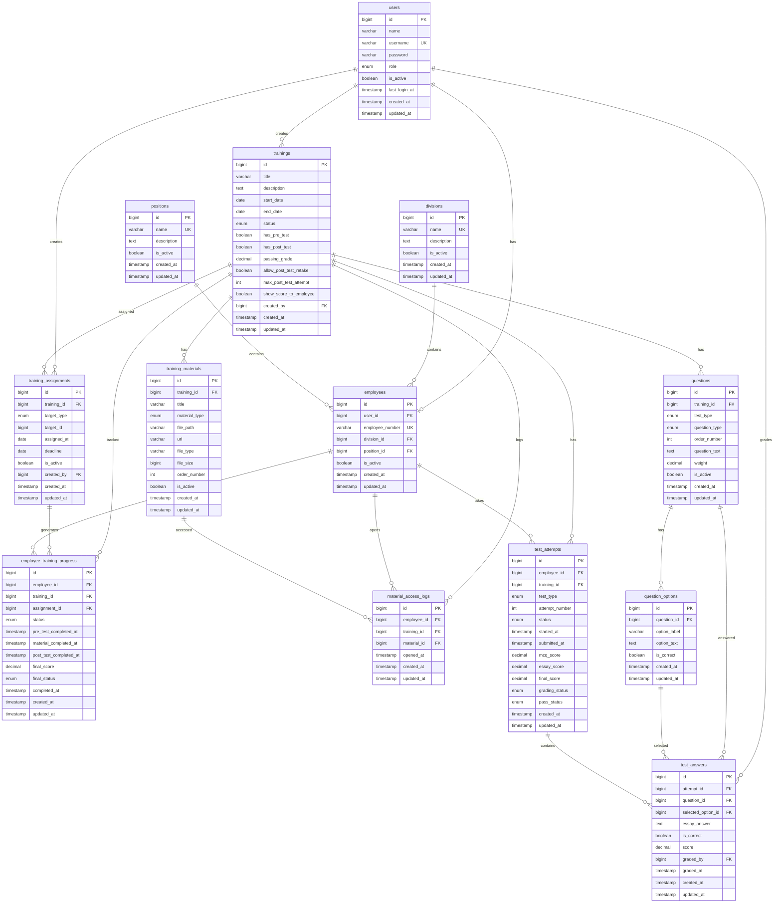

# 04. ERD / Data Model

# Sistem E-Learning Training Karyawan

------

## 4.1 Ringkasan Dokumen

Dokumen ERD / Data Model ini menjelaskan rancangan struktur database untuk Sistem E-Learning Training Karyawan.

Dokumen ini digunakan sebagai acuan untuk:

1. Menentukan tabel utama sistem.
2. Menentukan relasi antar tabel.
3. Menentukan field penting pada setiap tabel.
4. Menentukan primary key dan foreign key.
5. Menentukan constraint dan validasi data pada level database.
6. Menentukan index yang dibutuhkan untuk pencarian, filter, monitoring, dan laporan.
7. Menjadi dasar pembuatan migration Laravel dan implementasi database MySQL.

Sistem ini menggunakan pendekatan database relasional karena data utama saling berhubungan, seperti user, karyawan, divisi, jabatan, training, materi, soal, jawaban, nilai, progress, dan laporan.

------

## 4.2 Prinsip Data Model

Prinsip perancangan data model yang digunakan adalah:

1. Struktur database dibuat sederhana tetapi tetap rapi.
2. Login Admin dan Karyawan menggunakan satu tabel utama, yaitu `users`.
3. Detail khusus karyawan dipisahkan ke tabel `employees`.
4. Role sistem cukup menggunakan field sederhana karena sistem hanya memiliki dua role utama, yaitu Admin dan Karyawan.
5. Data master seperti divisi dan jabatan dipisahkan agar mudah dikelola.
6. Training memiliki pengaturan test langsung pada tabel `trainings`.
7. Materi training dibuat dalam tabel terpisah karena satu training dapat memiliki lebih dari satu materi.
8. Soal pre-test dan post-test disimpan dalam satu tabel dengan pembeda `test_type`.
9. Soal pilihan ganda dan essay disimpan dalam satu tabel dengan pembeda `question_type`.
10. Jawaban test menggunakan konsep attempt agar post-test dapat diulang sesuai pengaturan training.
11. Progress training karyawan disimpan dalam tabel khusus agar mudah dipantau dan dilaporkan.
12. Laporan tidak disimpan sebagai tabel fisik, tetapi dihasilkan dari query tabel progress, nilai, training, dan karyawan.
13. Sistem menggunakan kombinasi status aktif/nonaktif dan delete permanen.
14. Soft delete tidak digunakan sebagai aturan utama.
15. Index dibuat pada field yang sering digunakan untuk filter, pencarian, dan relasi.

------

# 4.3 Daftar Tabel Utama

Tabel utama yang digunakan dalam sistem adalah:

| No   | Nama Tabel                   | Fungsi                                       |
| ---- | ---------------------------- | -------------------------------------------- |
| 1    | `users`                      | Menyimpan data login Admin dan Karyawan      |
| 2    | `employees`                  | Menyimpan detail data karyawan               |
| 3    | `divisions`                  | Menyimpan data divisi                        |
| 4    | `positions`                  | Menyimpan data jabatan                       |
| 5    | `trainings`                  | Menyimpan data training dan pengaturan test  |
| 6    | `training_materials`         | Menyimpan data materi training               |
| 7    | `training_assignments`       | Menyimpan data penugasan training            |
| 8    | `employee_training_progress` | Menyimpan progress training setiap karyawan  |
| 9    | `material_access_logs`       | Mencatat akses materi oleh karyawan          |
| 10   | `questions`                  | Menyimpan soal pre-test dan post-test        |
| 11   | `question_options`           | Menyimpan pilihan jawaban soal pilihan ganda |
| 12   | `test_attempts`              | Menyimpan percobaan pengerjaan test          |
| 13   | `test_answers`               | Menyimpan jawaban karyawan per soal          |

Tabel opsional:

| No   | Nama Tabel | Fungsi                                                      |
| ---- | ---------- | ----------------------------------------------------------- |
| 14   | `sessions` | Menyimpan session jika Laravel menggunakan database session |

Tabel yang tidak digunakan pada versi awal:

| No   | Nama Tabel              | Alasan Tidak Digunakan                                  |
| ---- | ----------------------- | ------------------------------------------------------- |
| 1    | `roles`                 | Role cukup menggunakan field `role` di tabel `users`    |
| 2    | `permissions`           | Role permission detail tidak termasuk scope awal        |
| 3    | `password_reset_tokens` | Reset password karyawan dilakukan oleh Admin            |
| 4    | `reports`               | Laporan dibuat dari query, bukan disimpan sebagai tabel |
| 5    | `export_histories`      | Riwayat export belum dibutuhkan                         |
| 6    | `audit_logs`            | Audit log belum termasuk scope awal                     |

------

# 4.4 Kelompok Tabel Berdasarkan Modul

## 4.4.1 Authentication & User

Tabel:

1. `users`
2. `employees`

Modul ini digunakan untuk menyimpan data login dan identitas pengguna.

------

## 4.4.2 Master Data

Tabel:

1. `divisions`
2. `positions`

Modul ini digunakan untuk data dasar perusahaan yang berhubungan dengan karyawan dan filter laporan.

------

## 4.4.3 Training Management

Tabel:

1. `trainings`
2. `training_materials`
3. `training_assignments`

Modul ini digunakan untuk menyimpan data training, materi, dan penugasan training.

------

## 4.4.4 Progress & Tracking

Tabel:

1. `employee_training_progress`
2. `material_access_logs`

Modul ini digunakan untuk memantau progress training dan pencatatan akses materi.

------

## 4.4.5 Test & Assessment

Tabel:

1. `questions`
2. `question_options`
3. `test_attempts`
4. `test_answers`

Modul ini digunakan untuk menyimpan soal, pilihan jawaban, attempt test, jawaban karyawan, nilai otomatis, dan nilai essay.

------

# 4.5 Detail Tabel

------

## 4.5.1 Tabel `users`

### Fungsi

Tabel `users` digunakan untuk menyimpan data login Admin dan Karyawan.

Satu tabel `users` digunakan untuk kedua role agar proses autentikasi lebih sederhana.

### Field Penting

| Field           | Tipe Data       | Keterangan                         |
| --------------- | --------------- | ---------------------------------- |
| `id`            | BIGINT UNSIGNED | Primary key                        |
| `name`          | VARCHAR(100)    | Nama pengguna                      |
| `username`      | VARCHAR(50)     | Username untuk login               |
| `password`      | VARCHAR(255)    | Password terenkripsi               |
| `role`          | ENUM / VARCHAR  | Role pengguna: `admin`, `karyawan` |
| `is_active`     | BOOLEAN         | Status akun aktif atau nonaktif    |
| `last_login_at` | TIMESTAMP NULL  | Waktu terakhir login               |
| `created_at`    | TIMESTAMP       | Waktu data dibuat                  |
| `updated_at`    | TIMESTAMP       | Waktu data diperbarui              |

### Constraint

| Constraint  | Keterangan                                          |
| ----------- | --------------------------------------------------- |
| Primary key | `id`                                                |
| Unique      | `username`                                          |
| Required    | `name`, `username`, `password`, `role`, `is_active` |
| Enum value  | `role` hanya boleh `admin` atau `karyawan`          |

### Index

| Index                   | Keterangan                      |
| ----------------------- | ------------------------------- |
| `users_username_unique` | Mempercepat proses login        |
| `users_role_index`      | Memfilter user berdasarkan role |
| `users_is_active_index` | Memfilter akun aktif/nonaktif   |

### Contoh Data

| id   | name           | username | role     | is_active |
| ---- | -------------- | -------- | -------- | --------- |
| 1    | Admin Training | admin    | admin    | true      |
| 2    | Budi Santoso   | budi01   | karyawan | true      |

------

## 4.5.2 Tabel `employees`

### Fungsi

Tabel `employees` digunakan untuk menyimpan detail data karyawan.

Tabel ini dipisah dari `users` karena data karyawan memiliki relasi khusus dengan divisi, jabatan, training, progress, dan hasil test.

### Field Penting

| Field             | Tipe Data        | Keterangan                     |
| ----------------- | ---------------- | ------------------------------ |
| `id`              | BIGINT UNSIGNED  | Primary key                    |
| `user_id`         | BIGINT UNSIGNED  | Relasi ke tabel `users`        |
| `employee_number` | VARCHAR(50) NULL | NIP / ID karyawan              |
| `division_id`     | BIGINT UNSIGNED  | Relasi ke tabel `divisions`    |
| `position_id`     | BIGINT UNSIGNED  | Relasi ke tabel `positions`    |
| `is_active`       | BOOLEAN          | Status karyawan aktif/nonaktif |
| `created_at`      | TIMESTAMP        | Waktu data dibuat              |
| `updated_at`      | TIMESTAMP        | Waktu data diperbarui          |

### Constraint

| Constraint      | Keterangan                                           |
| --------------- | ---------------------------------------------------- |
| Primary key     | `id`                                                 |
| Foreign key     | `user_id` ke `users.id`                              |
| Foreign key     | `division_id` ke `divisions.id`                      |
| Foreign key     | `position_id` ke `positions.id`                      |
| Unique          | `user_id`                                            |
| Unique nullable | `employee_number` unik jika diisi                    |
| Required        | `user_id`, `division_id`, `position_id`, `is_active` |

### Index

| Index                             | Keterangan                              |
| --------------------------------- | --------------------------------------- |
| `employees_user_id_index`         | Relasi ke user                          |
| `employees_employee_number_index` | Pencarian berdasarkan NIP / ID karyawan |
| `employees_division_id_index`     | Filter berdasarkan divisi               |
| `employees_position_id_index`     | Filter berdasarkan jabatan              |
| `employees_is_active_index`       | Filter karyawan aktif/nonaktif          |

### Relasi

```text
users 1 --- 1 employees
divisions 1 --- many employees
positions 1 --- many employees
```

------

## 4.5.3 Tabel `divisions`

### Fungsi

Tabel `divisions` digunakan untuk menyimpan data divisi perusahaan.

Divisi digunakan pada data karyawan, penugasan training, filter monitoring, dan laporan.

### Field Penting

| Field         | Tipe Data       | Keterangan                   |
| ------------- | --------------- | ---------------------------- |
| `id`          | BIGINT UNSIGNED | Primary key                  |
| `name`        | VARCHAR(100)    | Nama divisi                  |
| `description` | TEXT NULL       | Deskripsi divisi             |
| `is_active`   | BOOLEAN         | Status divisi aktif/nonaktif |
| `created_at`  | TIMESTAMP       | Waktu data dibuat            |
| `updated_at`  | TIMESTAMP       | Waktu data diperbarui        |

### Constraint

| Constraint  | Keterangan          |
| ----------- | ------------------- |
| Primary key | `id`                |
| Unique      | `name`              |
| Required    | `name`, `is_active` |

### Index

| Index                       | Keterangan                   |
| --------------------------- | ---------------------------- |
| `divisions_name_unique`     | Mencegah nama divisi sama    |
| `divisions_is_active_index` | Filter divisi aktif/nonaktif |

### Relasi

```text
divisions 1 --- many employees
```

------

## 4.5.4 Tabel `positions`

### Fungsi

Tabel `positions` digunakan untuk menyimpan data jabatan karyawan.

Jabatan digunakan pada data karyawan, penugasan training, filter monitoring, dan laporan.

### Field Penting

| Field         | Tipe Data       | Keterangan                    |
| ------------- | --------------- | ----------------------------- |
| `id`          | BIGINT UNSIGNED | Primary key                   |
| `name`        | VARCHAR(100)    | Nama jabatan                  |
| `description` | TEXT NULL       | Deskripsi jabatan             |
| `is_active`   | BOOLEAN         | Status jabatan aktif/nonaktif |
| `created_at`  | TIMESTAMP       | Waktu data dibuat             |
| `updated_at`  | TIMESTAMP       | Waktu data diperbarui         |

### Constraint

| Constraint  | Keterangan          |
| ----------- | ------------------- |
| Primary key | `id`                |
| Unique      | `name`              |
| Required    | `name`, `is_active` |

### Index

| Index                       | Keterangan                    |
| --------------------------- | ----------------------------- |
| `positions_name_unique`     | Mencegah nama jabatan sama    |
| `positions_is_active_index` | Filter jabatan aktif/nonaktif |

### Relasi

```text
positions 1 --- many employees
```

------

## 4.5.5 Tabel `trainings`

### Fungsi

Tabel `trainings` digunakan untuk menyimpan data training dan pengaturan test.

Satu training dapat memiliki banyak materi, banyak soal, banyak penugasan, dan banyak progress karyawan.

### Field Penting

| Field                    | Tipe Data            | Keterangan                            |
| ------------------------ | -------------------- | ------------------------------------- |
| `id`                     | BIGINT UNSIGNED      | Primary key                           |
| `title`                  | VARCHAR(150)         | Judul training                        |
| `description`            | TEXT NULL            | Deskripsi training                    |
| `start_date`             | DATE                 | Tanggal mulai training                |
| `end_date`               | DATE                 | Tanggal selesai training              |
| `status`                 | ENUM / VARCHAR       | `draft`, `published`, `archived`      |
| `has_pre_test`           | BOOLEAN              | Apakah training memakai pre-test      |
| `has_post_test`          | BOOLEAN              | Apakah training memakai post-test     |
| `passing_grade`          | DECIMAL(5,2) NULL    | Nilai minimal kelulusan post-test     |
| `allow_post_test_retake` | BOOLEAN              | Apakah post-test boleh diulang        |
| `max_post_test_attempt`  | INT NULL             | Jumlah maksimal pengulangan post-test |
| `show_score_to_employee` | BOOLEAN              | Apakah nilai ditampilkan ke karyawan  |
| `created_by`             | BIGINT UNSIGNED NULL | User Admin yang membuat training      |
| `created_at`             | TIMESTAMP            | Waktu data dibuat                     |
| `updated_at`             | TIMESTAMP            | Waktu data diperbarui                 |

### Constraint

| Constraint  | Keterangan                                          |
| ----------- | --------------------------------------------------- |
| Primary key | `id`                                                |
| Foreign key | `created_by` ke `users.id`                          |
| Required    | `title`, `start_date`, `end_date`, `status`         |
| Enum value  | `status` hanya `draft`, `published`, `archived`     |
| Check       | `end_date` tidak boleh sebelum `start_date`         |
| Check       | `passing_grade` bernilai 0 sampai 100               |
| Check       | `max_post_test_attempt` minimal 1 jika retake aktif |

### Index

| Index                           | Keterangan                            |
| ------------------------------- | ------------------------------------- |
| `trainings_status_index`        | Filter berdasarkan status training    |
| `trainings_start_date_index`    | Filter berdasarkan tanggal mulai      |
| `trainings_end_date_index`      | Filter berdasarkan tanggal selesai    |
| `trainings_created_by_index`    | Relasi ke Admin pembuat               |
| `trainings_has_pre_test_index`  | Filter training berdasarkan pre-test  |
| `trainings_has_post_test_index` | Filter training berdasarkan post-test |

### Business Rule

1. Training baru dapat disimpan sebagai `draft`.
2. Training berstatus `published` dapat ditugaskan ke karyawan.
3. Training berstatus `archived` tidak dapat digunakan untuk penugasan baru.
4. Jika `has_pre_test = true`, karyawan wajib menyelesaikan pre-test sebelum membuka materi.
5. Jika `has_post_test = true`, karyawan dapat mengerjakan post-test setelah semua materi aktif pernah dibuka.
6. Jika `allow_post_test_retake = true`, maka `max_post_test_attempt` wajib diisi.
7. Jika `allow_post_test_retake = false`, maka post-test hanya boleh dikerjakan satu kali.
8. Nilai kelulusan diambil dari nilai post-test.
9. Jika karyawan mengulang post-test, nilai akhir yang digunakan adalah nilai attempt terakhir.

### Relasi

```text
users 1 --- many trainings
trainings 1 --- many training_materials
trainings 1 --- many questions
trainings 1 --- many training_assignments
trainings 1 --- many employee_training_progress
trainings 1 --- many test_attempts
```

------

## 4.5.6 Tabel `training_materials`

### Fungsi

Tabel `training_materials` digunakan untuk menyimpan data materi training.

Satu training dapat memiliki lebih dari satu materi. Materi dapat berupa file upload atau link eksternal.

### Field Penting

| Field           | Tipe Data         | Keterangan                      |
| --------------- | ----------------- | ------------------------------- |
| `id`            | BIGINT UNSIGNED   | Primary key                     |
| `training_id`   | BIGINT UNSIGNED   | Relasi ke tabel `trainings`     |
| `title`         | VARCHAR(150)      | Judul materi                    |
| `material_type` | ENUM / VARCHAR    | `file` atau `link`              |
| `file_path`     | VARCHAR(255) NULL | Path file jika tipe materi file |
| `url`           | VARCHAR(255) NULL | URL jika tipe materi link       |
| `file_type`     | VARCHAR(20) NULL  | Ekstensi file                   |
| `file_size`     | BIGINT NULL       | Ukuran file dalam byte          |
| `order_number`  | INT NULL          | Urutan materi                   |
| `is_active`     | BOOLEAN           | Status materi aktif/nonaktif    |
| `created_at`    | TIMESTAMP         | Waktu data dibuat               |
| `updated_at`    | TIMESTAMP         | Waktu data diperbarui           |

### Constraint

| Constraint           | Keterangan                                           |
| -------------------- | ---------------------------------------------------- |
| Primary key          | `id`                                                 |
| Foreign key          | `training_id` ke `trainings.id`                      |
| Required             | `training_id`, `title`, `material_type`, `is_active` |
| Enum value           | `material_type` hanya `file` atau `link`             |
| Conditional required | `file_path` wajib jika `material_type = file`        |
| Conditional required | `url` wajib jika `material_type = link`              |

### Index

| Index                                    | Keterangan                         |
| ---------------------------------------- | ---------------------------------- |
| `training_materials_training_id_index`   | Filter materi berdasarkan training |
| `training_materials_material_type_index` | Filter berdasarkan tipe materi     |
| `training_materials_is_active_index`     | Filter materi aktif/nonaktif       |
| `training_materials_order_number_index`  | Mengurutkan materi                 |

### Business Rule

1. Satu training dapat memiliki banyak materi.
2. Materi aktif tampil ke karyawan sesuai hak akses training.
3. Materi nonaktif tidak tampil ke karyawan.
4. Materi nonaktif tidak dihitung sebagai syarat membuka post-test.
5. Jika training memiliki pre-test, materi baru dapat dibuka setelah pre-test selesai.
6. Sistem hanya mencatat bahwa materi pernah dibuka, bukan durasi atau persentase tontonan.

### Relasi

```text
trainings 1 --- many training_materials
training_materials 1 --- many material_access_logs
```

------

## 4.5.7 Tabel `training_assignments`

### Fungsi

Tabel `training_assignments` digunakan untuk menyimpan data penugasan training.

Training dapat ditugaskan ke:

1. Karyawan tertentu.
2. Divisi tertentu.
3. Jabatan tertentu.

Setelah penugasan dibuat, sistem akan membuat data progress per karyawan pada tabel `employee_training_progress`.

### Field Penting

| Field         | Tipe Data            | Keterangan                         |
| ------------- | -------------------- | ---------------------------------- |
| `id`          | BIGINT UNSIGNED      | Primary key                        |
| `training_id` | BIGINT UNSIGNED      | Relasi ke tabel `trainings`        |
| `target_type` | ENUM / VARCHAR       | `employee`, `division`, `position` |
| `target_id`   | BIGINT UNSIGNED      | ID target sesuai `target_type`     |
| `assigned_at` | DATE                 | Tanggal penugasan                  |
| `deadline`    | DATE NULL            | Deadline training                  |
| `is_active`   | BOOLEAN              | Status penugasan aktif/nonaktif    |
| `created_by`  | BIGINT UNSIGNED NULL | Admin yang membuat penugasan       |
| `created_at`  | TIMESTAMP            | Waktu data dibuat                  |
| `updated_at`  | TIMESTAMP            | Waktu data diperbarui              |

### Constraint

| Constraint  | Keterangan                                                   |
| ----------- | ------------------------------------------------------------ |
| Primary key | `id`                                                         |
| Foreign key | `training_id` ke `trainings.id`                              |
| Foreign key | `created_by` ke `users.id`                                   |
| Required    | `training_id`, `target_type`, `target_id`, `assigned_at`, `is_active` |
| Enum value  | `target_type` hanya `employee`, `division`, `position`       |
| Check       | `deadline` tidak boleh sebelum `assigned_at`                 |

### Index

| Index                                    | Keterangan                            |
| ---------------------------------------- | ------------------------------------- |
| `training_assignments_training_id_index` | Filter penugasan berdasarkan training |
| `training_assignments_target_index`      | Filter berdasarkan target             |
| `training_assignments_assigned_at_index` | Filter berdasarkan tanggal assign     |
| `training_assignments_deadline_index`    | Filter berdasarkan deadline           |
| `training_assignments_is_active_index`   | Filter penugasan aktif/nonaktif       |

### Business Rule

1. Training hanya dapat ditugaskan jika status training adalah `published`.
2. Jika target adalah karyawan, sistem membuat progress untuk karyawan yang dipilih.
3. Jika target adalah divisi, sistem membuat progress untuk semua karyawan aktif pada divisi tersebut.
4. Jika target adalah jabatan, sistem membuat progress untuk semua karyawan aktif pada jabatan tersebut.
5. Sistem tidak boleh membuat progress duplikat untuk karyawan dan training yang sama.
6. Penugasan nonaktif tidak memberikan akses baru ke karyawan.

### Relasi

```text
trainings 1 --- many training_assignments
users 1 --- many training_assignments
training_assignments 1 --- many employee_training_progress
```

------

## 4.5.8 Tabel `employee_training_progress`

### Fungsi

Tabel `employee_training_progress` digunakan untuk menyimpan progress training setiap karyawan.

Tabel ini menjadi sumber utama untuk monitoring dan laporan training.

### Field Penting

| Field                    | Tipe Data            | Keterangan                              |
| ------------------------ | -------------------- | --------------------------------------- |
| `id`                     | BIGINT UNSIGNED      | Primary key                             |
| `employee_id`            | BIGINT UNSIGNED      | Relasi ke tabel `employees`             |
| `training_id`            | BIGINT UNSIGNED      | Relasi ke tabel `trainings`             |
| `assignment_id`          | BIGINT UNSIGNED NULL | Relasi ke tabel `training_assignments`  |
| `status`                 | ENUM / VARCHAR       | Status progress training                |
| `pre_test_completed_at`  | TIMESTAMP NULL       | Waktu pre-test selesai                  |
| `material_completed_at`  | TIMESTAMP NULL       | Waktu semua materi aktif selesai dibuka |
| `post_test_completed_at` | TIMESTAMP NULL       | Waktu post-test selesai                 |
| `final_score`            | DECIMAL(5,2) NULL    | Nilai akhir yang digunakan              |
| `final_status`           | ENUM / VARCHAR NULL  | `passed`, `failed`, `completed`         |
| `completed_at`           | TIMESTAMP NULL       | Waktu training selesai                  |
| `created_at`             | TIMESTAMP            | Waktu data dibuat                       |
| `updated_at`             | TIMESTAMP            | Waktu data diperbarui                   |

### Status Progress

Nilai yang disarankan untuk field `status`:

| Status                 | Keterangan                             |
| ---------------------- | -------------------------------------- |
| `not_started`          | Karyawan belum mulai training          |
| `pre_test_completed`   | Karyawan sudah menyelesaikan pre-test  |
| `in_material`          | Karyawan sedang mengakses materi       |
| `material_completed`   | Semua materi aktif sudah pernah dibuka |
| `post_test_completed`  | Post-test sudah dikerjakan             |
| `waiting_essay_review` | Menunggu penilaian essay dari Admin    |
| `passed`               | Karyawan lulus training                |
| `failed`               | Karyawan tidak lulus training          |
| `completed`            | Training selesai tanpa post-test       |

### Constraint

| Constraint  | Keterangan                                   |
| ----------- | -------------------------------------------- |
| Primary key | `id`                                         |
| Foreign key | `employee_id` ke `employees.id`              |
| Foreign key | `training_id` ke `trainings.id`              |
| Foreign key | `assignment_id` ke `training_assignments.id` |
| Unique      | Kombinasi `employee_id` dan `training_id`    |
| Required    | `employee_id`, `training_id`, `status`       |

### Index

| Index                               | Keterangan                           |
| ----------------------------------- | ------------------------------------ |
| `progress_employee_id_index`        | Filter progress berdasarkan karyawan |
| `progress_training_id_index`        | Filter progress berdasarkan training |
| `progress_assignment_id_index`      | Relasi ke assignment                 |
| `progress_status_index`             | Filter berdasarkan status            |
| `progress_final_status_index`       | Filter lulus/tidak lulus             |
| `progress_employee_training_unique` | Mencegah duplikasi progress          |

### Business Rule

1. Satu karyawan hanya memiliki satu progress untuk satu training.
2. Progress dibuat otomatis saat training ditugaskan.
3. Jika training tidak memiliki pre-test, karyawan dapat langsung mengakses materi.
4. Jika training tidak memiliki post-test, training selesai setelah semua materi aktif dibuka.
5. Jika training memiliki post-test, status akhir ditentukan dari hasil post-test.
6. Jika post-test memiliki essay, status menjadi `waiting_essay_review` sampai Admin memberi nilai.
7. Jika post-test diulang, nilai akhir pada progress mengikuti nilai attempt terakhir.
8. Jika nilai attempt terakhir memenuhi passing grade, status menjadi `passed`.
9. Jika nilai attempt terakhir tidak memenuhi passing grade dan tidak ada kesempatan mengulang, status menjadi `failed`.

### Relasi

```text
employees 1 --- many employee_training_progress
trainings 1 --- many employee_training_progress
training_assignments 1 --- many employee_training_progress
```

------

## 4.5.9 Tabel `material_access_logs`

### Fungsi

Tabel `material_access_logs` digunakan untuk mencatat materi yang pernah dibuka oleh karyawan.

Data ini digunakan untuk menentukan apakah karyawan sudah boleh mengerjakan post-test.

### Field Penting

| Field         | Tipe Data       | Keterangan                           |
| ------------- | --------------- | ------------------------------------ |
| `id`          | BIGINT UNSIGNED | Primary key                          |
| `employee_id` | BIGINT UNSIGNED | Relasi ke tabel `employees`          |
| `training_id` | BIGINT UNSIGNED | Relasi ke tabel `trainings`          |
| `material_id` | BIGINT UNSIGNED | Relasi ke tabel `training_materials` |
| `opened_at`   | TIMESTAMP       | Waktu materi dibuka                  |
| `created_at`  | TIMESTAMP       | Waktu data dibuat                    |
| `updated_at`  | TIMESTAMP       | Waktu data diperbarui                |

### Constraint

| Constraint  | Keterangan                                               |
| ----------- | -------------------------------------------------------- |
| Primary key | `id`                                                     |
| Foreign key | `employee_id` ke `employees.id`                          |
| Foreign key | `training_id` ke `trainings.id`                          |
| Foreign key | `material_id` ke `training_materials.id`                 |
| Unique      | Kombinasi `employee_id` dan `material_id`                |
| Required    | `employee_id`, `training_id`, `material_id`, `opened_at` |

### Index

| Index                                    | Keterangan                                         |
| ---------------------------------------- | -------------------------------------------------- |
| `material_logs_employee_id_index`        | Filter berdasarkan karyawan                        |
| `material_logs_training_id_index`        | Filter berdasarkan training                        |
| `material_logs_material_id_index`        | Filter berdasarkan materi                          |
| `material_logs_opened_at_index`          | Filter berdasarkan waktu akses                     |
| `material_logs_employee_material_unique` | Mencegah log utama berulang untuk materi yang sama |

### Business Rule

1. Sistem mencatat satu kali akses utama untuk setiap materi yang dibuka karyawan.
2. Jika karyawan membuka materi yang sama berkali-kali, sistem tidak perlu membuat data duplikat.
3. Post-test baru terbuka jika semua materi aktif pada training sudah memiliki log akses.
4. Materi nonaktif tidak dihitung sebagai syarat membuka post-test.

### Relasi

```text
employees 1 --- many material_access_logs
trainings 1 --- many material_access_logs
training_materials 1 --- many material_access_logs
```

------

## 4.5.10 Tabel `questions`

### Fungsi

Tabel `questions` digunakan untuk menyimpan soal pre-test dan post-test.

Soal pilihan ganda dan essay disimpan dalam tabel yang sama. Pembeda jenis soal menggunakan field `question_type`.

### Field Penting

| Field           | Tipe Data       | Keterangan                     |
| --------------- | --------------- | ------------------------------ |
| `id`            | BIGINT UNSIGNED | Primary key                    |
| `training_id`   | BIGINT UNSIGNED | Relasi ke tabel `trainings`    |
| `test_type`     | ENUM / VARCHAR  | `pre_test` atau `post_test`    |
| `question_type` | ENUM / VARCHAR  | `multiple_choice` atau `essay` |
| `order_number`  | INT             | Nomor urut soal                |
| `question_text` | TEXT            | Isi pertanyaan                 |
| `weight`        | DECIMAL(5,2)    | Bobot nilai soal               |
| `is_active`     | BOOLEAN         | Status soal aktif/nonaktif     |
| `created_at`    | TIMESTAMP       | Waktu data dibuat              |
| `updated_at`    | TIMESTAMP       | Waktu data diperbarui          |

### Constraint

| Constraint  | Keterangan                                                   |
| ----------- | ------------------------------------------------------------ |
| Primary key | `id`                                                         |
| Foreign key | `training_id` ke `trainings.id`                              |
| Required    | `training_id`, `test_type`, `question_type`, `order_number`, `question_text`, `weight`, `is_active` |
| Enum value  | `test_type` hanya `pre_test` atau `post_test`                |
| Enum value  | `question_type` hanya `multiple_choice` atau `essay`         |
| Unique      | Kombinasi `training_id`, `test_type`, dan `order_number`     |
| Check       | `weight` harus lebih dari 0                                  |

### Index

| Index                           | Keterangan                                     |
| ------------------------------- | ---------------------------------------------- |
| `questions_training_id_index`   | Filter soal berdasarkan training               |
| `questions_test_type_index`     | Filter pre-test/post-test                      |
| `questions_question_type_index` | Filter pilihan ganda/essay                     |
| `questions_is_active_index`     | Filter soal aktif/nonaktif                     |
| `questions_order_unique`        | Mencegah nomor soal dobel dalam test yang sama |

### Business Rule

1. Satu training dapat memiliki soal pre-test dan post-test.
2. Satu test dapat berisi campuran soal pilihan ganda dan essay.
3. Nomor soal harus unik dalam satu training dan satu jenis test.
4. Soal nonaktif tidak tampil saat karyawan mengerjakan test.
5. Soal essay tidak memiliki data pada tabel `question_options`.
6. Soal pilihan ganda wajib memiliki pilihan jawaban.

### Relasi

```text
trainings 1 --- many questions
questions 1 --- many question_options
questions 1 --- many test_answers
```

------

## 4.5.11 Tabel `question_options`

### Fungsi

Tabel `question_options` digunakan untuk menyimpan pilihan jawaban pada soal pilihan ganda.

Kunci jawaban disimpan menggunakan field `is_correct`.

### Field Penting

| Field          | Tipe Data       | Keterangan                       |
| -------------- | --------------- | -------------------------------- |
| `id`           | BIGINT UNSIGNED | Primary key                      |
| `question_id`  | BIGINT UNSIGNED | Relasi ke tabel `questions`      |
| `option_label` | VARCHAR(10)     | Label pilihan, contoh A, B, C, D |
| `option_text`  | TEXT            | Isi pilihan jawaban              |
| `is_correct`   | BOOLEAN         | Penanda pilihan jawaban benar    |
| `created_at`   | TIMESTAMP       | Waktu data dibuat                |
| `updated_at`   | TIMESTAMP       | Waktu data diperbarui            |

### Constraint

| Constraint  | Keterangan                                                 |
| ----------- | ---------------------------------------------------------- |
| Primary key | `id`                                                       |
| Foreign key | `question_id` ke `questions.id`                            |
| Required    | `question_id`, `option_label`, `option_text`, `is_correct` |
| Unique      | Kombinasi `question_id` dan `option_label`                 |

### Index

| Index                                | Keterangan                                   |
| ------------------------------------ | -------------------------------------------- |
| `question_options_question_id_index` | Relasi ke soal                               |
| `question_options_is_correct_index`  | Mempercepat pengecekan kunci jawaban         |
| `question_options_label_unique`      | Mencegah label pilihan dobel dalam satu soal |

### Business Rule

1. Tabel ini hanya digunakan untuk soal pilihan ganda.
2. Satu soal pilihan ganda dapat memiliki beberapa pilihan jawaban.
3. Minimal satu pilihan jawaban harus bernilai `is_correct = true`.
4. Untuk versi awal, satu soal pilihan ganda disarankan hanya memiliki satu jawaban benar.
5. Jika soal dihapus permanen, pilihan jawaban ikut terhapus.

### Relasi

```text
questions 1 --- many question_options
question_options 1 --- many test_answers
```

------

## 4.5.12 Tabel `test_attempts`

### Fungsi

Tabel `test_attempts` digunakan untuk menyimpan percobaan pengerjaan test oleh karyawan.

Pre-test dan post-test menggunakan tabel yang sama. Pembeda jenis test menggunakan field `test_type`.

### Field Penting

| Field            | Tipe Data              | Keterangan                  |
| ---------------- | ---------------------- | --------------------------- |
| `id`             | BIGINT UNSIGNED        | Primary key                 |
| `employee_id`    | BIGINT UNSIGNED        | Relasi ke tabel `employees` |
| `training_id`    | BIGINT UNSIGNED        | Relasi ke tabel `trainings` |
| `test_type`      | ENUM / VARCHAR         | `pre_test` atau `post_test` |
| `attempt_number` | INT                    | Nomor percobaan             |
| `status`         | ENUM / VARCHAR         | Status pengerjaan attempt   |
| `started_at`     | TIMESTAMP NULL         | Waktu mulai test            |
| `submitted_at`   | TIMESTAMP NULL         | Waktu submit test           |
| `mcq_score`      | DECIMAL(5,2) DEFAULT 0 | Nilai pilihan ganda         |
| `essay_score`    | DECIMAL(5,2) DEFAULT 0 | Nilai essay                 |
| `final_score`    | DECIMAL(5,2) NULL      | Nilai akhir attempt         |
| `grading_status` | ENUM / VARCHAR         | Status penilaian            |
| `pass_status`    | ENUM / VARCHAR NULL    | `passed` atau `failed`      |
| `created_at`     | TIMESTAMP              | Waktu data dibuat           |
| `updated_at`     | TIMESTAMP              | Waktu data diperbarui       |

### Status Attempt

Nilai yang disarankan untuk field `status`:

| Status        | Keterangan                      |
| ------------- | ------------------------------- |
| `in_progress` | Test sedang dikerjakan          |
| `submitted`   | Test sudah disubmit             |
| `graded`      | Test sudah dinilai              |
| `cancelled`   | Test dibatalkan jika diperlukan |

### Status Penilaian

Nilai yang disarankan untuk field `grading_status`:

| Status                  | Keterangan                              |
| ----------------------- | --------------------------------------- |
| `auto_graded`           | Semua soal dapat dinilai otomatis       |
| `waiting_manual_review` | Ada essay yang menunggu penilaian Admin |
| `manual_reviewed`       | Essay sudah dinilai Admin               |

### Constraint

| Constraint  | Keterangan                                                   |
| ----------- | ------------------------------------------------------------ |
| Primary key | `id`                                                         |
| Foreign key | `employee_id` ke `employees.id`                              |
| Foreign key | `training_id` ke `trainings.id`                              |
| Required    | `employee_id`, `training_id`, `test_type`, `attempt_number`, `status` |
| Enum value  | `test_type` hanya `pre_test` atau `post_test`                |
| Unique      | Kombinasi `employee_id`, `training_id`, `test_type`, dan `attempt_number` |
| Check       | `attempt_number` minimal 1                                   |
| Check       | Score bernilai 0 sampai 100                                  |

### Index

| Index                                | Keterangan                          |
| ------------------------------------ | ----------------------------------- |
| `test_attempts_employee_id_index`    | Filter attempt berdasarkan karyawan |
| `test_attempts_training_id_index`    | Filter attempt berdasarkan training |
| `test_attempts_test_type_index`      | Filter pre-test/post-test           |
| `test_attempts_status_index`         | Filter status attempt               |
| `test_attempts_grading_status_index` | Filter status penilaian             |
| `test_attempts_pass_status_index`    | Filter lulus/tidak lulus            |
| `test_attempts_unique_attempt`       | Mencegah attempt dobel              |

### Business Rule

1. Pre-test dan post-test disimpan dalam tabel yang sama.
2. Pre-test hanya memiliki satu attempt untuk setiap karyawan dan training.
3. Post-test dapat memiliki lebih dari satu attempt jika pengaturan retake aktif.
4. Jumlah attempt post-test tidak boleh melebihi `max_post_test_attempt`.
5. Jika post-test tidak boleh diulang, hanya attempt pertama yang diperbolehkan.
6. Nilai pilihan ganda dihitung otomatis oleh sistem.
7. Jika test memiliki essay, attempt berstatus `waiting_manual_review`.
8. Nilai akhir dihitung dari `mcq_score + essay_score`.
9. Kelulusan ditentukan dari `final_score` pada post-test.
10. Jika post-test diulang, nilai final progress mengikuti attempt terakhir, bukan nilai tertinggi.

### Relasi

```text
employees 1 --- many test_attempts
trainings 1 --- many test_attempts
test_attempts 1 --- many test_answers
```

------

## 4.5.13 Tabel `test_answers`

### Fungsi

Tabel `test_answers` digunakan untuk menyimpan jawaban karyawan untuk setiap soal dalam suatu attempt.

Tabel ini menyimpan jawaban pilihan ganda dan essay.

### Field Penting

| Field                | Tipe Data              | Keterangan                      |
| -------------------- | ---------------------- | ------------------------------- |
| `id`                 | BIGINT UNSIGNED        | Primary key                     |
| `attempt_id`         | BIGINT UNSIGNED        | Relasi ke tabel `test_attempts` |
| `question_id`        | BIGINT UNSIGNED        | Relasi ke tabel `questions`     |
| `selected_option_id` | BIGINT UNSIGNED NULL   | Jawaban pilihan ganda           |
| `essay_answer`       | TEXT NULL              | Jawaban essay                   |
| `is_correct`         | BOOLEAN NULL           | Benar/salah untuk pilihan ganda |
| `score`              | DECIMAL(5,2) DEFAULT 0 | Nilai jawaban                   |
| `graded_by`          | BIGINT UNSIGNED NULL   | Admin yang menilai essay        |
| `graded_at`          | TIMESTAMP NULL         | Waktu penilaian essay           |
| `created_at`         | TIMESTAMP              | Waktu data dibuat               |
| `updated_at`         | TIMESTAMP              | Waktu data diperbarui           |

### Constraint

| Constraint           | Keterangan                                         |
| -------------------- | -------------------------------------------------- |
| Primary key          | `id`                                               |
| Foreign key          | `attempt_id` ke `test_attempts.id`                 |
| Foreign key          | `question_id` ke `questions.id`                    |
| Foreign key          | `selected_option_id` ke `question_options.id`      |
| Foreign key          | `graded_by` ke `users.id`                          |
| Unique               | Kombinasi `attempt_id` dan `question_id`           |
| Conditional required | `selected_option_id` wajib jika soal pilihan ganda |
| Conditional required | `essay_answer` wajib jika soal essay               |

### Index

| Index                                   | Keterangan                                                   |
| --------------------------------------- | ------------------------------------------------------------ |
| `test_answers_attempt_id_index`         | Filter jawaban berdasarkan attempt                           |
| `test_answers_question_id_index`        | Relasi ke soal                                               |
| `test_answers_selected_option_id_index` | Relasi ke pilihan jawaban                                    |
| `test_answers_graded_by_index`          | Relasi ke Admin penilai                                      |
| `test_answers_unique_answer`            | Mencegah jawaban dobel untuk soal yang sama pada attempt yang sama |

### Business Rule

1. Satu attempt memiliki banyak jawaban.
2. Satu soal hanya boleh memiliki satu jawaban dalam satu attempt.
3. Untuk pilihan ganda, sistem menyimpan `selected_option_id`.
4. Untuk essay, sistem menyimpan `essay_answer`.
5. Jawaban pilihan ganda dinilai otomatis.
6. Jawaban essay dinilai manual oleh Admin.
7. Nilai essay disimpan pada field `score`.
8. Field `graded_by` dan `graded_at` diisi ketika Admin menilai essay.
9. Total nilai pada tabel ini direkap ke tabel `test_attempts`.

### Relasi

```text
test_attempts 1 --- many test_answers
questions 1 --- many test_answers
question_options 1 --- many test_answers
users 1 --- many test_answers
```

------

# 4.6 Tabel Opsional

## 4.6.1 Tabel `sessions`

### Fungsi

Tabel `sessions` digunakan jika Laravel dikonfigurasi untuk menyimpan session pada database.

Tabel ini opsional dan tidak termasuk tabel utama bisnis sistem.

### Field Umum

| Field           | Tipe Data            | Keterangan             |
| --------------- | -------------------- | ---------------------- |
| `id`            | VARCHAR(255)         | Primary key session    |
| `user_id`       | BIGINT UNSIGNED NULL | User yang sedang login |
| `ip_address`    | VARCHAR(45) NULL     | IP address user        |
| `user_agent`    | TEXT NULL            | Informasi browser      |
| `payload`       | LONGTEXT             | Data session           |
| `last_activity` | INT                  | Aktivitas terakhir     |

------

# 4.7 Relasi Antar Tabel

## 4.7.1 Relasi Authentication & Employee

```text
users 1 --- 1 employees
divisions 1 --- many employees
positions 1 --- many employees
```

Penjelasan:

1. Satu user dengan role karyawan memiliki satu data employee.
2. Satu divisi dapat memiliki banyak karyawan.
3. Satu jabatan dapat dimiliki banyak karyawan.

------

## 4.7.2 Relasi Training

```text
users 1 --- many trainings
trainings 1 --- many training_materials
trainings 1 --- many training_assignments
trainings 1 --- many employee_training_progress
```

Penjelasan:

1. Admin dapat membuat banyak training.
2. Satu training dapat memiliki banyak materi.
3. Satu training dapat memiliki banyak penugasan.
4. Satu training dapat memiliki banyak progress karyawan.

------

## 4.7.3 Relasi Penugasan dan Progress

```text
training_assignments 1 --- many employee_training_progress
employees 1 --- many employee_training_progress
trainings 1 --- many employee_training_progress
```

Penjelasan:

1. Satu assignment dapat menghasilkan banyak progress karyawan.
2. Satu karyawan dapat memiliki banyak progress training.
3. Satu training dapat memiliki banyak progress dari karyawan berbeda.

------

## 4.7.4 Relasi Materi dan Akses Materi

```text
training_materials 1 --- many material_access_logs
employees 1 --- many material_access_logs
trainings 1 --- many material_access_logs
```

Penjelasan:

1. Satu materi dapat dibuka oleh banyak karyawan.
2. Satu karyawan dapat membuka banyak materi.
3. Log akses materi digunakan untuk menentukan apakah post-test boleh dibuka.

------

## 4.7.5 Relasi Soal dan Pilihan Jawaban

```text
trainings 1 --- many questions
questions 1 --- many question_options
```

Penjelasan:

1. Satu training dapat memiliki banyak soal.
2. Satu soal pilihan ganda dapat memiliki banyak pilihan jawaban.
3. Soal essay tidak memiliki data pilihan jawaban.

------

## 4.7.6 Relasi Attempt dan Jawaban

```text
employees 1 --- many test_attempts
trainings 1 --- many test_attempts
test_attempts 1 --- many test_answers
questions 1 --- many test_answers
question_options 1 --- many test_answers
```

Penjelasan:

1. Satu karyawan dapat memiliki banyak attempt test.
2. Satu training dapat memiliki banyak attempt test.
3. Satu attempt memiliki banyak jawaban.
4. Setiap jawaban terhubung ke satu soal.
5. Jawaban pilihan ganda terhubung ke pilihan jawaban yang dipilih.

------

# 4.8 Diagram ERD Mermaid



------

# 4.9 Constraint Utama

## 4.9.1 Unique Constraint

| Tabel                        | Field                                                       | Keterangan                                                  |
| ---------------------------- | ----------------------------------------------------------- | ----------------------------------------------------------- |
| `users`                      | `username`                                                  | Username tidak boleh sama                                   |
| `employees`                  | `user_id`                                                   | Satu user hanya punya satu employee profile                 |
| `employees`                  | `employee_number`                                           | NIP / ID karyawan unik jika diisi                           |
| `divisions`                  | `name`                                                      | Nama divisi tidak boleh sama                                |
| `positions`                  | `name`                                                      | Nama jabatan tidak boleh sama                               |
| `employee_training_progress` | `employee_id`, `training_id`                                | Satu karyawan hanya punya satu progress untuk satu training |
| `material_access_logs`       | `employee_id`, `material_id`                                | Satu materi hanya dicatat satu kali per karyawan            |
| `questions`                  | `training_id`, `test_type`, `order_number`                  | Nomor soal unik per training dan jenis test                 |
| `question_options`           | `question_id`, `option_label`                               | Label jawaban tidak boleh dobel dalam satu soal             |
| `test_attempts`              | `employee_id`, `training_id`, `test_type`, `attempt_number` | Attempt tidak boleh dobel                                   |
| `test_answers`               | `attempt_id`, `question_id`                                 | Satu soal hanya dijawab satu kali dalam satu attempt        |

------

## 4.9.2 Foreign Key Constraint

| Tabel                        | Field                | Referensi                 |
| ---------------------------- | -------------------- | ------------------------- |
| `employees`                  | `user_id`            | `users.id`                |
| `employees`                  | `division_id`        | `divisions.id`            |
| `employees`                  | `position_id`        | `positions.id`            |
| `trainings`                  | `created_by`         | `users.id`                |
| `training_materials`         | `training_id`        | `trainings.id`            |
| `training_assignments`       | `training_id`        | `trainings.id`            |
| `training_assignments`       | `created_by`         | `users.id`                |
| `employee_training_progress` | `employee_id`        | `employees.id`            |
| `employee_training_progress` | `training_id`        | `trainings.id`            |
| `employee_training_progress` | `assignment_id`      | `training_assignments.id` |
| `material_access_logs`       | `employee_id`        | `employees.id`            |
| `material_access_logs`       | `training_id`        | `trainings.id`            |
| `material_access_logs`       | `material_id`        | `training_materials.id`   |
| `questions`                  | `training_id`        | `trainings.id`            |
| `question_options`           | `question_id`        | `questions.id`            |
| `test_attempts`              | `employee_id`        | `employees.id`            |
| `test_attempts`              | `training_id`        | `trainings.id`            |
| `test_answers`               | `attempt_id`         | `test_attempts.id`        |
| `test_answers`               | `question_id`        | `questions.id`            |
| `test_answers`               | `selected_option_id` | `question_options.id`     |
| `test_answers`               | `graded_by`          | `users.id`                |

------

## 4.9.3 Check Constraint

| Tabel           | Constraint                        | Keterangan                                        |
| --------------- | --------------------------------- | ------------------------------------------------- |
| `trainings`     | `end_date >= start_date`          | Tanggal selesai tidak boleh sebelum tanggal mulai |
| `trainings`     | `passing_grade BETWEEN 0 AND 100` | Passing grade harus 0 sampai 100                  |
| `trainings`     | `max_post_test_attempt >= 1`      | Maksimal attempt minimal 1 jika retake aktif      |
| `questions`     | `weight > 0`                      | Bobot soal harus lebih dari 0                     |
| `test_attempts` | `attempt_number >= 1`             | Nomor attempt minimal 1                           |
| `test_attempts` | `final_score BETWEEN 0 AND 100`   | Nilai akhir harus 0 sampai 100                    |
| `test_answers`  | `score >= 0`                      | Nilai jawaban tidak boleh negatif                 |

------

# 4.10 Index Utama

Index dibuat untuk mempercepat pencarian, filter, relasi, monitoring, dan laporan.

| Tabel                        | Index                                     | Kegunaan                            |
| ---------------------------- | ----------------------------------------- | ----------------------------------- |
| `users`                      | `username`                                | Login                               |
| `users`                      | `role`                                    | Filter role                         |
| `users`                      | `is_active`                               | Filter akun aktif                   |
| `employees`                  | `division_id`                             | Filter karyawan per divisi          |
| `employees`                  | `position_id`                             | Filter karyawan per jabatan         |
| `employees`                  | `employee_number`                         | Search NIP / ID                     |
| `trainings`                  | `status`                                  | Filter draft/published/archived     |
| `trainings`                  | `start_date`, `end_date`                  | Filter bulan/tahun training         |
| `training_materials`         | `training_id`                             | Menampilkan materi per training     |
| `training_materials`         | `is_active`                               | Filter materi aktif                 |
| `training_assignments`       | `training_id`                             | Menampilkan assignment per training |
| `training_assignments`       | `target_type`, `target_id`                | Menampilkan target assignment       |
| `employee_training_progress` | `employee_id`                             | Melihat progress per karyawan       |
| `employee_training_progress` | `training_id`                             | Monitoring per training             |
| `employee_training_progress` | `status`                                  | Filter progress                     |
| `employee_training_progress` | `final_status`                            | Filter lulus/tidak lulus            |
| `material_access_logs`       | `employee_id`, `training_id`              | Cek materi yang sudah dibuka        |
| `questions`                  | `training_id`, `test_type`                | Menampilkan soal pre/post-test      |
| `questions`                  | `question_type`                           | Filter pilihan ganda/essay          |
| `question_options`           | `question_id`                             | Menampilkan opsi per soal           |
| `test_attempts`              | `employee_id`, `training_id`, `test_type` | Menampilkan hasil test              |
| `test_attempts`              | `grading_status`                          | Filter menunggu penilaian           |
| `test_attempts`              | `pass_status`                             | Filter lulus/tidak lulus            |
| `test_answers`               | `attempt_id`                              | Menampilkan jawaban per attempt     |
| `test_answers`               | `question_id`                             | Relasi jawaban ke soal              |
| `test_answers`               | `graded_by`                               | Riwayat penilai essay               |

------

# 4.11 Aturan Delete dan Relasi

## 4.11.1 Data yang Menggunakan Restrict

Data berikut sebaiknya tidak dapat dihapus jika masih digunakan:

| Data            | Alasan                                                 |
| --------------- | ------------------------------------------------------ |
| Divisi          | Jika masih digunakan oleh karyawan                     |
| Jabatan         | Jika masih digunakan oleh karyawan                     |
| Training        | Jika sudah memiliki assignment, progress, atau attempt |
| Karyawan        | Jika sudah memiliki progress atau attempt              |
| Materi          | Jika sudah memiliki log akses                          |
| Soal            | Jika sudah memiliki jawaban                            |
| Pilihan jawaban | Jika sudah dipilih oleh karyawan                       |

Untuk delete permanen, aplikasi harus menampilkan konfirmasi dan mengecek apakah data masih digunakan.

------

## 4.11.2 Data yang Dapat Cascade

Data turunan yang sangat melekat dengan parent dapat menggunakan cascade jika aman.

| Parent                 | Child                        | Aturan                                                |
| ---------------------- | ---------------------------- | ----------------------------------------------------- |
| `questions`            | `question_options`           | Cascade jika soal belum pernah dijawab                |
| `test_attempts`        | `test_answers`               | Cascade jika attempt dihapus oleh sistem              |
| `trainings`            | `training_materials`         | Cascade hanya jika training belum pernah ditugaskan   |
| `training_assignments` | `employee_training_progress` | Tidak disarankan cascade jika progress sudah berjalan |

------

# 4.12 Business Rule Data Model

## 4.12.1 User dan Karyawan

1. Semua pengguna login melalui tabel `users`.
2. User dengan role `admin` tidak wajib memiliki data di tabel `employees`.
3. User dengan role `karyawan` wajib memiliki data di tabel `employees`.
4. Username harus unik.
5. Password harus disimpan dalam bentuk terenkripsi.
6. User nonaktif tidak dapat login.
7. Karyawan nonaktif tidak dapat diberikan training baru.
8. Karyawan nonaktif tetap dapat muncul pada riwayat training lama.

------

## 4.12.2 Training

1. Training dapat berstatus `draft`, `published`, atau `archived`.
2. Training berstatus `draft` belum dapat ditugaskan.
3. Training berstatus `published` dapat ditugaskan.
4. Training berstatus `archived` tidak dapat ditugaskan lagi.
5. Training dapat memiliki pre-test, post-test, keduanya, atau tanpa test.
6. Jika training memiliki post-test, passing grade wajib diisi.
7. Jika post-test boleh diulang, jumlah maksimal attempt wajib diisi.
8. Nilai hanya ditampilkan ke karyawan jika `show_score_to_employee = true`.

------

## 4.12.3 Materi

1. Satu training dapat memiliki lebih dari satu materi.
2. Materi dapat berupa file atau link.
3. Materi aktif dapat diakses oleh karyawan yang memiliki progress training.
4. Materi nonaktif tidak tampil ke karyawan.
5. Materi nonaktif tidak dihitung sebagai syarat membuka post-test.
6. Sistem hanya mencatat bahwa materi pernah dibuka.
7. Sistem tidak mencatat durasi belajar.
8. Sistem tidak mencatat persentase tontonan video.

------

## 4.12.4 Penugasan Training

1. Admin dapat menugaskan training ke karyawan, divisi, atau jabatan.
2. Training hanya dapat ditugaskan jika status training adalah `published`.
3. Penugasan ke divisi akan menghasilkan progress untuk semua karyawan aktif pada divisi tersebut.
4. Penugasan ke jabatan akan menghasilkan progress untuk semua karyawan aktif pada jabatan tersebut.
5. Penugasan ke karyawan akan menghasilkan progress untuk karyawan yang dipilih.
6. Sistem tidak boleh membuat progress duplikat untuk karyawan dan training yang sama.

------

## 4.12.5 Progress Training

1. Progress dibuat ketika training ditugaskan.
2. Progress digunakan untuk monitoring dan laporan.
3. Jika training memiliki pre-test, materi terkunci sampai pre-test selesai.
4. Jika training tidak memiliki pre-test, materi langsung dapat diakses.
5. Jika training memiliki post-test, post-test terbuka setelah semua materi aktif pernah dibuka.
6. Jika training tidak memiliki post-test, training selesai setelah semua materi aktif pernah dibuka.
7. Jika post-test memiliki essay, status progress menjadi `waiting_essay_review`.
8. Jika nilai post-test memenuhi passing grade, status akhir menjadi `passed`.
9. Jika nilai post-test tidak memenuhi passing grade dan masih ada attempt, karyawan dapat mengulang post-test.
10. Jika nilai post-test tidak memenuhi passing grade dan tidak ada attempt tersisa, status akhir menjadi `failed`.
11. Jika post-test diulang, nilai akhir progress menggunakan nilai attempt terakhir.

------

## 4.12.6 Soal dan Jawaban

1. Soal pre-test dan post-test berada dalam tabel yang sama.
2. Jenis test dibedakan dengan field `test_type`.
3. Jenis soal dibedakan dengan field `question_type`.
4. Satu test dapat berisi campuran soal pilihan ganda dan essay.
5. Nomor soal harus unik berdasarkan training dan jenis test.
6. Soal pilihan ganda wajib memiliki pilihan jawaban.
7. Soal essay tidak memiliki pilihan jawaban.
8. Pilihan jawaban benar ditandai dengan `is_correct = true`.
9. Jawaban pilihan ganda dinilai otomatis oleh sistem.
10. Jawaban essay dinilai manual oleh Admin.

------

## 4.12.7 Attempt dan Nilai

1. Pre-test dan post-test menggunakan tabel `test_attempts`.
2. Pre-test hanya boleh satu attempt.
3. Post-test dapat memiliki lebih dari satu attempt jika retake aktif.
4. Jumlah attempt post-test mengikuti `max_post_test_attempt`.
5. Nilai pilihan ganda disimpan di `mcq_score`.
6. Nilai essay disimpan di `essay_score`.
7. Nilai akhir attempt disimpan di `final_score`.
8. Jika ada essay yang belum dinilai, `final_score` belum final.
9. Jika essay sudah dinilai, sistem menghitung ulang nilai akhir.
10. Kelulusan ditentukan dari attempt post-test.
11. Jika post-test diulang, nilai akhir training menggunakan attempt terakhir.

------

# 4.13 Sumber Data untuk Laporan

Laporan tidak memerlukan tabel fisik khusus.

Sumber data laporan berasal dari:

| Jenis Laporan             | Sumber Tabel                                           |
| ------------------------- | ------------------------------------------------------ |
| Laporan progress training | `employee_training_progress`, `employees`, `trainings` |
| Laporan nilai pre-test    | `test_attempts`, `employees`, `trainings`              |
| Laporan nilai post-test   | `test_attempts`, `employees`, `trainings`              |
| Laporan kelulusan         | `employee_training_progress`, `test_attempts`          |
| Laporan per divisi        | `employees`, `divisions`, `employee_training_progress` |
| Laporan per jabatan       | `employees`, `positions`, `employee_training_progress` |
| Export PDF                | Hasil query laporan                                    |
| Export Excel              | Hasil query laporan                                    |

------

# 4.14 Contoh Alur Data

## 4.14.1 Admin Membuat Training

1. Admin login melalui tabel `users`.
2. Admin membuat training baru.
3. Data tersimpan di tabel `trainings`.
4. Admin menambahkan materi.
5. Data materi tersimpan di tabel `training_materials`.
6. Admin menambahkan soal.
7. Data soal tersimpan di tabel `questions`.
8. Jika soal pilihan ganda, opsi tersimpan di tabel `question_options`.

------

## 4.14.2 Admin Menugaskan Training ke Divisi

1. Admin memilih training yang berstatus `published`.
2. Admin memilih target penugasan `division`.
3. Data penugasan tersimpan di tabel `training_assignments`.
4. Sistem mencari semua karyawan aktif pada divisi tersebut.
5. Sistem membuat data progress di tabel `employee_training_progress`.
6. Training muncul pada halaman Training Saya milik karyawan.

------

## 4.14.3 Karyawan Mengikuti Training

1. Karyawan login melalui tabel `users`.
2. Sistem membaca data karyawan dari tabel `employees`.
3. Sistem membaca daftar training dari `employee_training_progress`.
4. Karyawan membuka detail training.
5. Jika pre-test aktif, karyawan mengerjakan pre-test.
6. Attempt pre-test tersimpan di `test_attempts`.
7. Jawaban pre-test tersimpan di `test_answers`.
8. Setelah pre-test selesai, materi terbuka.
9. Saat karyawan membuka materi, data tersimpan di `material_access_logs`.
10. Jika semua materi aktif sudah dibuka, post-test terbuka.
11. Karyawan mengerjakan post-test.
12. Attempt post-test tersimpan di `test_attempts`.
13. Jawaban post-test tersimpan di `test_answers`.
14. Sistem menilai pilihan ganda otomatis.
15. Jika ada essay, Admin menilai manual.
16. Sistem menghitung nilai akhir.
17. Sistem memperbarui progress training.

------

## 4.14.4 Karyawan Mengulang Post-Test

1. Karyawan mendapatkan nilai post-test di bawah passing grade.
2. Sistem mengecek apakah `allow_post_test_retake = true`.
3. Sistem mengecek apakah jumlah attempt belum melebihi `max_post_test_attempt`.
4. Jika masih ada kesempatan, karyawan dapat mengulang post-test.
5. Sistem membuat data baru di `test_attempts` dengan `attempt_number` berikutnya.
6. Jawaban baru disimpan di `test_answers`.
7. Sistem menghitung nilai attempt baru.
8. Nilai akhir pada progress menggunakan attempt terakhir.
9. Jika attempt terakhir lulus, progress menjadi `passed`.
10. Jika attempt terakhir gagal dan tidak ada kesempatan mengulang, progress menjadi `failed`.

